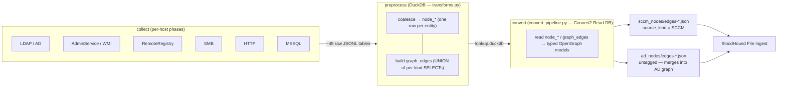
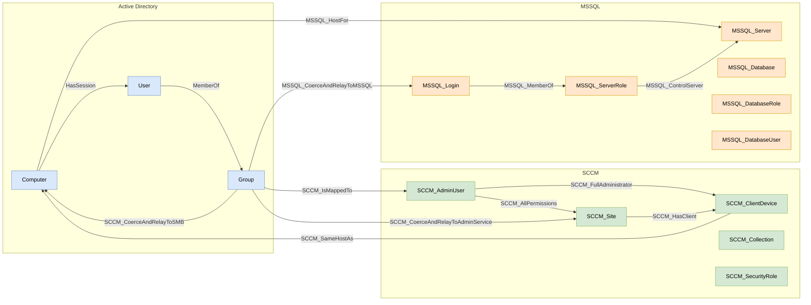
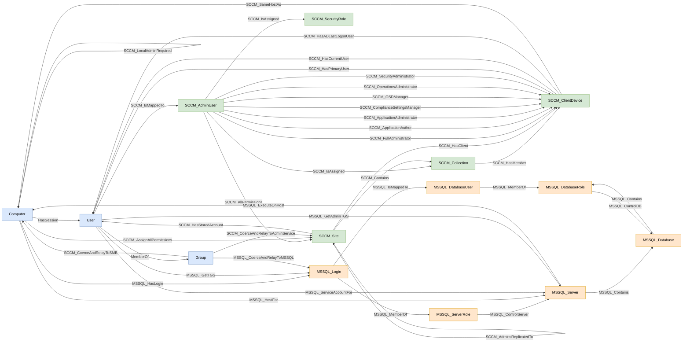

# OpenHound SCCM Collector


The **OpenHound SCCM collector** brings SCCM (Microsoft Configuration Manager) attack paths into [BloodHound](https://github.com/SpecterOps/BloodHound) using [OpenGraph](https://specterops.io/opengraph). It is the [OpenHound](https://github.com/SpecterOps/openhound) port of [ConfigManBearPig](https://specterops.io/blog/2026/01/13/introducing-configmanbearpig-a-bloodhound-opengraph-collector-for-sccm/), the PowerShell SCCM collector by Chris Thompson ([@_Mayyhem](https://x.com/_Mayyhem)) at [SpecterOps](https://x.com/SpecterOps).

Where the PowerShell tool is a single self-contained script, this version runs on the OpenHound framework's three-stage pipeline (`collect` → `preprocess` → `convert`), producing an OpenGraph dataset you upload to BloodHound's **File Ingest**.

> ## 🚧 Work in progress
>
> This port is **mid-migration**. The collection side is broad, and Stages 1–6 of the graph pipeline are now shipping. As of today:
>
> - **`collect`** runs LDAP / Local / DNS **discovery** plus six real **per-host** phases — **RemoteRegistry**, **MSSQL** EPA detection, **AdminService**, **WMI** (the AdminService fallback), **HTTP** (unauthenticated site-system role probing), and **SMB** (signing check + SCCM share-role enumeration). AdminService, WMI, HTTP, and SMB are **collect-only** (raw `adminservice_*` / `wmi_*` / `http_*` / `smb_*` tables; graph conversion is a later phase). **DHCP** is accepted on the command line but not yet ported.
> - **`convert`** emits fourteen node kinds — [`Computer`](#computer), [`User`](#user), [`Group`](#group), [`SCCM_Site`](#sccm_site), [`SCCM_ClientDevice`](#sccm_clientdevice), [`SCCM_Collection`](#sccm_collection), [`SCCM_AdminUser`](#sccm_adminuser), [`SCCM_SecurityRole`](#sccm_securityrole), [`MSSQL_Server`](#mssql_server), [`MSSQL_Database`](#mssql_database), [`MSSQL_ServerRole`](#mssql_serverrole), [`MSSQL_DatabaseRole`](#mssql_databaserole), [`MSSQL_Login`](#mssql_login), and [`MSSQL_DatabaseUser`](#mssql_databaseuser) — and thirty-seven edge kinds: the eleven from Stages 1–2 ([`SCCM_AdminsReplicatedTo`](#sccm_adminsreplicatedto), [`SCCM_HasClient`](#sccm_hasclient), [`SCCM_HasMember`](#sccm_hasmember), [`SCCM_IsMappedTo`](#sccm_ismappedto), [`SCCM_IsAssigned`](#sccm_isassigned), [`SCCM_HasPrimaryUser`](#sccm_hasprimaryuser--sccm_hascurrentuser--sccm_hasadlastlogonuser), [`SCCM_HasCurrentUser`](#sccm_hasprimaryuser--sccm_hascurrentuser--sccm_hasadlastlogonuser), [`SCCM_HasADLastLogonUser`](#sccm_hasprimaryuser--sccm_hascurrentuser--sccm_hasadlastlogonuser), [`SCCM_HasStoredAccount`](#sccm_hasstoredaccount), [`MemberOf`](#memberof), [`HasSession`](#hassession)) plus ten new from Stage 3 ([`SCCM_Contains`](#sccm_contains), [`SCCM_FullAdministrator`](#sccm_fulladministrator), [`SCCM_ApplicationAuthor`](#sccm_applicationauthor), [`SCCM_ApplicationAdministrator`](#sccm_applicationadministrator), [`SCCM_ComplianceSettingsManager`](#sccm_compliancesettingsmanager), [`SCCM_OSDManager`](#sccm_osdmanager), [`SCCM_OperationsAdministrator`](#sccm_operationsadministrator), [`SCCM_SecurityAdministrator`](#sccm_securityadministrator), [`SCCM_AllPermissions`](#sccm_allpermissions), [`SCCM_AssignAllPermissions`](#sccm_assignallpermissions)) plus two new from Stage 4 ([`SCCM_SameHostAs`](#sccm_samehostas), [`SCCM_LocalAdminRequired`](#sccm_localadminrequired)) plus eleven new from Stage 5 ([`MSSQL_Contains`](#mssql_contains), [`MSSQL_ControlServer`](#mssql_controlserver), [`MSSQL_ControlDB`](#mssql_controldb), [`MSSQL_HostFor`](#mssql_hostfor), [`MSSQL_ExecuteOnHost`](#mssql_executeonhost), [`MSSQL_HasLogin`](#mssql_haslogin), [`MSSQL_IsMappedTo`](#mssql_ismappedto), [`MSSQL_MemberOf`](#mssql_memberof), [`MSSQL_ServiceAccountFor`](#mssql_serviceaccountfor), [`MSSQL_GetTGS`](#mssql_gettgs), [`MSSQL_GetAdminTGS`](#mssql_getadmintgs)) plus three new from Stage 6 ([`SCCM_CoerceAndRelayToAdminService`](#sccm_coerceandrelaytoadminservice), [`MSSQL_CoerceAndRelayToMSSQL`](#mssql_coerceandrelaytomssql), [`SCCM_CoerceAndRelayToSMB`](#sccm_coerceandrelaytosmb)); `SCCM_AssignAllPermissions` gains a new Database→Site configuration in Stage 5 but is not a new kind string.
>
> This README documents **what the code actually does today**, not the finished design. For the full intended model, see the PowerShell tool's reference doc, [README-CMBP.md](README-CMBP.md).

Questions? Reach out on the [BloodHound Slack](http://ghst.ly/BHSlack) (@Mayyhem), on Twitter ([@_Mayyhem](https://x.com/_Mayyhem)), or open an issue.

---

# Table of Contents

- [Quick Start](#quick-start)
- [Collection Overview](#collection-overview)
- [System Requirements](#system-requirements)
- [Assumptions](#assumptions)
- [Limitations](#limitations)
- [Command Line Options](#command-line-options)
- [Graph Model](#graph-model)
- [Node Reference](#node-reference)
  - [Computer](#computer)
  - [User](#user)
  - [Group](#group)
  - [SCCM_Site](#sccm_site)
  - [SCCM_ClientDevice](#sccm_clientdevice)
  - [SCCM_Collection](#sccm_collection)
  - [SCCM_AdminUser](#sccm_adminuser)
  - [SCCM_SecurityRole](#sccm_securityrole)
  - [MSSQL_Server](#mssql_server)
  - [MSSQL_Database](#mssql_database)
  - [MSSQL_ServerRole](#mssql_serverrole)
  - [MSSQL_DatabaseRole](#mssql_databaserole)
  - [MSSQL_Login](#mssql_login)
  - [MSSQL_DatabaseUser](#mssql_databaseuser)
- [Edge Reference](#edge-reference)
  - [Entity-panel help properties](#entity-panel-help-properties)
  - [SCCM_AdminsReplicatedTo](#sccm_adminsreplicatedto)
  - [SCCM_HasClient](#sccm_hasclient)
  - [SCCM_HasMember](#sccm_hasmember)
  - [SCCM_IsMappedTo](#sccm_ismappedto)
  - [SCCM_IsAssigned](#sccm_isassigned)
  - [SCCM_HasPrimaryUser / SCCM_HasCurrentUser / SCCM_HasADLastLogonUser](#sccm_hasprimaryuser--sccm_hascurrentuser--sccm_hasadlastlogonuser)
  - [MemberOf](#memberof)
  - [HasSession](#hassession)
  - [SCCM_HasStoredAccount](#sccm_hasstoredaccount)
  - [SCCM_Contains](#sccm_contains)
  - [SCCM_FullAdministrator](#sccm_fulladministrator)
  - [SCCM_ApplicationAuthor](#sccm_applicationauthor)
  - [SCCM_ApplicationAdministrator](#sccm_applicationadministrator)
  - [SCCM_ComplianceSettingsManager](#sccm_compliancesettingsmanager)
  - [SCCM_OSDManager](#sccm_osdmanager)
  - [SCCM_OperationsAdministrator](#sccm_operationsadministrator)
  - [SCCM_SecurityAdministrator](#sccm_securityadministrator)
  - [SCCM_AllPermissions](#sccm_allpermissions)
  - [SCCM_AssignAllPermissions](#sccm_assignallpermissions)
  - [SCCM_SameHostAs](#sccm_samehostas)
  - [SCCM_LocalAdminRequired](#sccm_localadminrequired)
  - [MSSQL_Contains](#mssql_contains)
  - [MSSQL_ControlServer](#mssql_controlserver)
  - [MSSQL_ControlDB](#mssql_controldb)
  - [MSSQL_HostFor](#mssql_hostfor)
  - [MSSQL_ExecuteOnHost](#mssql_executeonhost)
  - [MSSQL_HasLogin](#mssql_haslogin)
  - [MSSQL_IsMappedTo](#mssql_ismappedto)
  - [MSSQL_MemberOf](#mssql_memberof)
  - [MSSQL_GetTGS](#mssql_gettgs)
  - [MSSQL_ServiceAccountFor](#mssql_serviceaccountfor)
  - [MSSQL_GetAdminTGS](#mssql_getadmintgs)
  - [SCCM_CoerceAndRelayToAdminService](#sccm_coerceandrelaytoadminservice)
  - [MSSQL_CoerceAndRelayToMSSQL](#mssql_coerceandrelaytomssql)
  - [SCCM_CoerceAndRelayToSMB](#sccm_coerceandrelaytosmb)
- [Understanding the Codebase](#understanding-the-codebase)
- [Contributing](#contributing)

---

# Quick Start

The collector is an OpenHound extension. All commands run from this directory (`sccm/sccm/`) through [`uv`](https://docs.astral.sh/uv/), which manages the virtual environment and pulls in the OpenHound framework.

### 1. Install dependencies

```powershell
uv sync
```

This installs the runtime dependencies (`ldap3`, `impacket`, `dnspython`, and — on Windows — `pywin32` and `winkerberos`) plus the OpenHound framework itself, which provides the `openhound` CLI.

### 2. Collect

Run from a domain-joined Windows host as the current user (the domain and a domain controller are auto-detected):

```powershell
uv run openhound collect sccm .\out -v
```

Or supply everything explicitly (required on Linux/macOS, where the current-user domain context can't be auto-detected):

```powershell
uv run openhound collect sccm .\out -d mayyhem.com --dc dc01.mayyhem.com -u "MAYYHEM\lowpriv" -p "Passw0rd!" -v
```

Limit which per-host phases run, and which hosts they target:

```powershell
# Only check the PS1 site database server for Extended Protection for Authentication
uv run openhound collect sccm .\out -d mayyhem.com -m RemoteRegistry,MSSQL -c ps1-db.mayyhem.com -v
```

`collect` writes raw JSONL tables under `.\out\sccm\<table>\` and prints a per-resource row-count summary plus the next commands to run.

### 3. Preprocess (build the lookup database)

```powershell
uv run openhound preprocess sccm .\out .\lookup.duckdb
```

This loads the raw JSONL into DuckDB and builds the lookup/derived tables that `convert` reads (site hierarchies, SID resolution, role mappings, and so on).

### 4. Convert (produce the OpenGraph dataset)

```powershell
uv run openhound convert sccm .\out\sccm .\graph --lookup-file .\lookup.duckdb
```

#### One command, end to end

Run all three stages against the lab in a single command:

```powershell
uv run openhound collect sccm .\out --run-all -d mayyhem.com --dc dc01.mayyhem.com -u "MAYYHEM\lowpriv" -p "Passw0rd!"
```

This collects into `.\out`, builds `.\out\lookup.duckdb`, and writes the OpenGraph
files to `.\out\graph\`. It is exactly equivalent to running:

```powershell
uv run openhound collect sccm .\out -d mayyhem.com --dc dc01.mayyhem.com -u "MAYYHEM\lowpriv" -p "Passw0rd!"
uv run openhound preprocess sccm .\out .\out\lookup.duckdb
uv run openhound convert sccm .\out\sccm .\out\graph --lookup-file .\out\lookup.duckdb
```

If preprocess or convert fails, your raw collected data in `.\out` is left intact
and the exact resume commands are logged, so you never have to recollect.

### 5. Upload to BloodHound

The collector can push the graph straight into BloodHound CE itself — no manual File Ingest step. Create an API token in BloodHound CE (**Administration → API Keys**), then pass it with `-B`:

One command — collect, build the graph, and upload schema + results to BloodHound CE:

```powershell
uv run openhound collect sccm .\out -d mayyhem.com --dc dc01.mayyhem.com `
  -u "MAYYHEM\lowpriv" -p "Passw0rd!" --run-all `
  -B "<token-id>:<token-key>@https://bloodhound.mayyhem.com"
```

Re-upload an existing run without recollecting:

```powershell
uv run openhound convert sccm .\out\sccm .\out\graph --lookup-file .\out\lookup.duckdb `
  -B "<token-id>:<token-key>@https://bloodhound.mayyhem.com"
```

Push only the schema (registers the `SCCM_*` and `MSSQL_*` kinds/icons), no data:

```powershell
uv run openhound collect sccm .\out --skip-collection --upload-schema-only `
  -B "<token-id>:<token-key>@https://bloodhound.mayyhem.com"
```

See [BloodHound Upload](#bloodhound-upload) under Command Line Options for every flag, the equivalent environment variables, and what each command actually uploads.

If you'd rather upload by hand instead, the OpenGraph files convert writes can also be dragged into the BloodHound UI under **Administration → File Ingest**. Either way, to query the SCCM kinds, BloodHound must use the **PostgreSQL** graph backend (the prebuilt SCCM kinds will not resolve on Neo4j): https://bloodhound.specterops.io/get-started/custom-installation#postgresql

> **Verbosity tip:** the console shows INFO (step summaries) by default; `-v` raises it to the chattier VERBOSE level (per-resolution / per-node traces, matching the PowerShell tool's `[Verbose]` tier); `--debug` adds the framework's `dlt` and `ldap3` internals; `--silent` mutes the console entirely. Whatever the console level, **every run always writes two files** into the output directory: **`collect_full_<timestamp>.log`** — the complete, human-ordered DEBUG trace of the collector, grouped host-by-host (per-host phases) and resource-by-resource (discovery), so you can always read the full story after the fact without re-running; and **`collect_issues_<timestamp>.log`** — just the warnings and errors, each with a full traceback (a clean run writes no issues file). `--debug` additionally folds `dlt`/`ldap3` internals into the full log.

---

# Collection Overview

`collect` runs in two stages, defined in [`collect_sccm`](src/openhound_sccm/main.py) and [`source.py`](src/openhound_sccm/source.py).

```text
                       openhound collect sccm
                                │
        ┌───────────────────────┴───────────────────────┐
        │  Stage 1 — Discovery (runs once)               │
        │  LDAP · Local · DNS                            │
        │  → seeds the work queue with candidate hosts   │
        └───────────────────────┬───────────────────────┘
                                │
        ┌───────────────────────┴───────────────────────┐
        │  Stage 2 — Per-host phases (worker pool)       │
        │  RemoteRegistry · MSSQL  [· AdminService ...]  │
        │  gated by --collection-methods                 │
        │  loops as new hosts are discovered             │
        └───────────────────────┬───────────────────────┘
                                │
                      raw JSONL on disk
                                │
              preprocess  →  DuckDB lookup database
                                │
               convert  →  OpenGraph nodes (+ edges, planned)
```

## Stage 1 — Discovery (once-phases)

These resources run a single time per collection and seed the per-host work queue. They are not gated by `--collection-methods` in the current build.

| Discovery resource | What it does | Status |
|---|---|---|
| **LDAP** ([collectors/ldap.py](src/openhound_sccm/collectors/ldap.py)) | Queries the AD **System Management** container for SCCM **sites** (`mSSMSSite`), **management points** (`mSSMSManagementPoint`), the container **DACL**, network-boot servers, devices with the `CmRcService` SPN, and computers whose names/descriptions match SCCM naming patterns (`sccm`, `mecm`, `sms`, …). Registers discovered site systems as per-host targets. | ✅ Implemented |
| **Local** ([collectors/local.py](src/openhound_sccm/collectors/local.py)) | When run on an SCCM client: reads the `root\CCM` WMI namespace (`SMS_Authority`, `SMS_LookupMP`, `CCM_Client`) and parses CCM client logs to find management points / distribution points and the local client's SMSID. **Windows-only.** | ✅ Implemented (Windows) |
| **DNS** ([collectors/dns.py](src/openhound_sccm/collectors/dns.py)) | For each discovered site code, resolves the `_mssms_mp_<sitecode>._tcp.<domain>` SRV record (with an ADIDNS/LDAP fallback) to find management points published to DNS. | ✅ Implemented |

## Stage 2 — Per-host phases

Each discovered (or `--computers`-supplied) host runs through the ordered per-host phases in [`per_host_phases.py`](src/openhound_sccm/per_host_phases.py), concurrently across a worker pool (`--threads`). A phase only runs for a host when its name is enabled by `--collection-methods` (`method_enabled` in [context.py](src/openhound_sccm/context.py)).

| Phase | What it does | Status |
|---|---|---|
| **RemoteRegistry** ([collectors/registry.py](src/openhound_sccm/collectors/registry.py)) | Binds the remote registry over SMB (impacket `rrp`) to read SCCM keys under `HKLM\SOFTWARE\Microsoft\SMS` — site codes, component servers/roles, current users, and SQL/MSSQL settings. Retries the initial bind to absorb the RemoteRegistry trigger-start race. | ✅ Implemented |
| **MSSQL** ([collectors/mssql.py](src/openhound_sccm/collectors/mssql.py)) | Connects to the host's SQL Server (TCP/1433) and probes its **Extended Protection for Authentication (EPA)** enforcement using [clients/mssql_epa.py](src/openhound_sccm/clients/mssql_epa.py). | ✅ Implemented |
| **AdminService** ([collectors/privileged.py](src/openhound_sccm/collectors/privileged.py)) | Queries the SCCM AdminService REST API (`https://<provider>/AdminService/wmi/...`) over Negotiate and collects the site hierarchy, site definitions, reserved accounts, devices, users, **security groups** (`SMS_R_UserGroup` — each group's name *and* SID, used to resolve `SecurityGroupName` memberships to Group nodes offline), collections, security roles, admins, and site-system roles into raw `adminservice_*` tables. Collect-only (graph conversion is a later phase). | ✅ Implemented (collect-only) |
| **WMI** ([collectors/privileged.py](src/openhound_sccm/collectors/privileged.py)) | **Fallback for AdminService.** Shares the *same* collection helpers as the AdminService phase (one set, parameterized per transport in `privileged.py`); when AdminService is unreachable on a host, it reads the same SMS Provider classes directly in the `root\SMS\site_<code>` WMI namespace (over DCOM via impacket, or pywin32 for the current Windows user) and writes the matching `wmi_*` tables. Runs only on hosts AdminService did **not** already collect — gated by `should_run_phase` reading `TargetEntry.completed_phases`. | ✅ Implemented (collect-only) |
| **HTTP** ([collectors/http.py](src/openhound_sccm/collectors/http.py)) | **Unauthenticated** probing of the SCCM web endpoints over http then https — `SMS_MP/.sms_aut` (`MPKEYINFORMATION`/`MPLIST`/`SMSTRC`/`MPLIST1`), `SMS_DP_SMSPKG$`, `AdminService/wmi/SMS_Identification`, and the site-signing certificate — to identify **Management Point**, **Distribution Point**, **SMS Provider**, and **Site Server** roles from the 401/403/200 status codes. Enumerates and registers sibling MPs and the site server as new probe targets; writes raw `http_*` role tables. On a confirmed Management Point, also fetches `/CCM_Client/ccmsetup.exe` (still unauthenticated) and regexes the embedded version string out of the binary to fingerprint the site's SCCM build (the [SCCMVersionGuesser](https://github.com/synacktiv/SCCMVersionGuesser) technique) — feeds `SCCM_Site.version`/`versionCVEs` when privileged collection found no version. **Bandwidth/OPSEC note:** v1 downloads the entire `ccmsetup.exe` (multiple MB) rather than a bounded/`Range` fetch, which is a bigger and noisier footprint than every other probe in this row (those read a few KB of XML/JSON at most); a bounded fetch is a future optimization. Skipped on hosts AdminService/WMI already collected. Collect-only (graph conversion is a later phase). | ✅ Implemented (collect-only) |
| **SMB** ([collectors/smb.py](src/openhound_sccm/collectors/smb.py)) | An **unauthenticated** SMB2-negotiate **signing-required** check (via [clients/smb.py](src/openhound_sccm/clients/smb.py)), then **authenticated** share enumeration (`NetShareEnum`) that classifies SCCM-specific shares — `SMS_SITE`/`SMS_<code>` (Site Server), `SMS_DP$` (Distribution Point), `REMINST` (PXE), `SCCMContentLib$`/`SMSPKG` (content library) — into site-system roles and a site code. Writes raw `smb_computers` / `smb_sites` tables. Skipped on hosts AdminService/WMI already collected. Collect-only (graph conversion is a later phase). | ✅ Implemented (collect-only) |
| **DHCP** | Accepted as a `--collection-methods` token, but the per-host collector is not yet ported. | 🚧 Not yet ported |

> The site version this HTTP fingerprint (or privileged AdminService/WMI collection) resolves also gates the [`SCCM_CoerceAndRelayToAdminService`](#sccm_coerceandrelaytoadminservice) edge: a site **confirmed** to run **SCCM 2509 or later** (build ≥ 9141) suppresses the edge, because that AdminService version rejects NTLM authentication outright. An unknown or unparseable version keeps the edge (fail-open — a possible edge that can't be confirmed mitigated stays in the graph).

---

# System Requirements

**Host running the collector:**

- **Python 3.13 or 3.14** (`requires-python = ">=3.13,<3.15"`) and [`uv`](https://docs.astral.sh/uv/).
- The **OpenHound framework** (installed automatically via `uv sync`; pulled from `git+https://github.com/SpecterOps/openhound.git`).
- Network line of sight to a **domain controller** and to the SCCM systems you target.
- **Active Directory context.** On **Windows**, the domain and a domain controller are auto-detected from the current user's context (`USERDNSDOMAIN`, then a DNS SRV lookup). On **Linux/macOS** you must pass `-d/--domain` (and `-u`/`-p` for any phase that authenticates); `--dc` is still resolved via DNS SRV if omitted.
- **Windows-only features:** local WMI/log collection, and current-user integrated authentication (Kerberos via `winkerberos`, NTLM via SSPI/`pywin32`). On Linux, integrated auth needs `gssapi[kerberos]` installed separately; explicit credentials work everywhere.

**Privileges needed per phase:**

| Phase | Minimum privilege |
|---|---|
| LDAP / DNS discovery | Any authenticated domain user |
| RemoteRegistry | **Local administrator** on the target |
| MSSQL (EPA detection) | Any domain user can probe a reachable SQL Server; reading the setting via RemoteRegistry instead needs local admin on the DB host |
| SMB | The signing-required check is **unauthenticated** (anyone with TCP/445 line of sight); share enumeration needs an **authenticated** SMB session (any domain user — current Windows user via SSPI, or `-u`/`-p`, `--nt-hash`, `--ticket`) |

**BloodHound side:**

- BloodHound with **OpenGraph** support.
- A **PostgreSQL** graph backend, required for the custom SCCM kinds to resolve: https://bloodhound.specterops.io/get-started/custom-installation#postgresql

**A note on `uv` and Python on Windows:** [pyproject.toml](pyproject.toml) sets `python-preference = "only-system"`. uv-managed (`python-build-standalone`) builds ship a `libcrypto` without the `OPENSSL_Applink` cross-CRT shim, which aborts TLS handshakes mid-flight — so on Windows the collector deliberately prefers an official/system Python.

---

# Assumptions

The collector relies on these assumptions about the target environment and how its output is consumed. They hold for the overwhelming majority of real deployments, but violating one can corrupt the graph (see [Limitations](#limitations)).

- **Site codes are unique within an organization.** A site code is only three characters and SCCM provides no globally unique hierarchy identifier, so the collector uses the (hierarchy-root) **site code as the `environmentid`** for SCCM-native nodes — those with no AD-domain home (`SCCM_Site` today, and the other SCCM-specific kinds as the port adds them). If two distinct hierarchies in the same organization reuse a site code, their SCCM environments collide and merge. Microsoft likewise recommends against reusing site codes within a forest: https://learn.microsoft.com/en-us/intune/configmgr/core/servers/deploy/install/prepare-to-install-sites#bkmk_sitecodes
- **One organization per graph.** Do not load data collected from two different organizations into the same BloodHound graph. Because site codes are not globally unique across organizations, a shared site code would merge the two organizations' SCCM environments. Collect and ingest each organization into its own graph.

> AD-native nodes (`Computer`, `User`, `Group`) are unaffected by the above: they use their AD **domain SID** as `environmentid`, so they merge with existing SharpHound data by SID rather than by site code.

---

# Limitations

- **Graph output covers Stages 1–6.** `convert` now emits fourteen node kinds and thirty-seven edge kinds (see the [Node Reference](#node-reference) and [Edge Reference](#edge-reference)). Richer edges (NAA secrets) are planned for later stages.
- **MSSQL logins, database users, and roles are inferred from SCCM topology, not enumerated from SQL.** The `MSSQL_Login` and `MSSQL_DatabaseUser` nodes (and the `sysadmin` / `db_owner` role nodes) are built from SCCM's knowledge of which computers are Primary Site Servers or SMS Providers for a given site — the same inference CMBP makes. No live SQL connection is opened during `preprocess` or `convert`; the collector's MSSQL phase only probes EPA. This means logins/users/roles are only created for SCCM-linked SQL servers, and only for the machine accounts SCCM architecturally grants `sysadmin` access.
- **Non-SCCM SQL servers appear as bare `MSSQL_Server` nodes.** SQL servers discovered by the EPA scan or RemoteRegistry that are not referenced by any SCCM site produce an `MSSQL_Server` node (with `MSSQL_HostFor` / `MSSQL_ExecuteOnHost` edges) but no `MSSQL_Database`, `MSSQL_Login`, or role nodes — CMBP likewise skips these and the collector follows suit.
- **MSSQL nodes land in the SCCM payload; AD-touching MSSQL edges land in the AD payload.** The six MSSQL node kinds are written to `sccm_nodes-*.json` / `sccm_edges-*.json` (tagged `source_kind = "SCCM"`). Edges that touch an AD node — `MSSQL_HostFor`, `MSSQL_ExecuteOnHost`, `MSSQL_HasLogin`, `MSSQL_GetTGS`, `MSSQL_ServiceAccountFor`, and `MSSQL_GetAdminTGS` — are routed into `ad_edges-*.json` by the split step. Upload both file sets together.
- **Some node properties are deferred to later collectors or stages.** The following properties appear in ConfigManBearPig but are not yet emitted because the required collector does not exist or the data is coupled to a later pipeline stage:
  - **DHCP/PXE fields on `Computer`** (`pxe_vendor_class`, `pxe_next_server`, `pxe_boot_file`, `tftp_reachable`, `is_dhcp_server`) — blocked on a DHCP/PXE collector (gtk tickets `Ope-o6bh` / `Ope-gqwo`). The collector can detect *whether* a host is PXE-enabled (SMB `REMINST` share → `SCCMIsPXESupportEnabled`) but not the DHCP/PXE configuration parameters.
  - **NAA flag on `User`** (`is_sccm_network_access_account`) — requires NAA secret decryption (`--enable-bad-opsec`) and a dedicated NAA collector, neither of which is implemented yet.
  - **Group DN / SAM account name** (`distinguishedName`, `samAccountName` on `Group`) — groups are built from name-only lists resolved to SIDs; no LDAP group-object lookup is performed.
  - **Several `SCCM_ClientDevice` fields** (`distinguishedName`, `dNSHostName`, `domain`) — not present in the AdminService/WMI device columns collected; would require a collection-phase change. (`currentManagementPoint` and `previousSMSID` were in this list previously but are now emitted — see the [`SCCM_ClientDevice`](#sccm_clientdevice) node reference.)
- **Some per-host phases are not yet ported.** RemoteRegistry, MSSQL, AdminService, WMI, HTTP, and SMB collect real data (AdminService/WMI/HTTP/SMB are collect-only — raw tables, some graph now); DHCP is a placeholder.
- **Possible-client nodes are inferred, not confirmed.** Devices with a `CmRcService` SPN in AD but no confirmed SCCM enrollment are emitted as `SCCM_ClientDevice` nodes with `is_confirmed_active_client = false`. They will **not** appear in the ConfigMgr console Devices tab (they were never enrolled — the SPN can linger in AD after a client is removed, or belong to a machine reporting to another hierarchy). Their `SCCM_HasClient` edge starts from a Primary site (never the CAS). Pass `--disable-possible-edges` at collection time to suppress them (the flag is persisted in the `collection_settings` table and gated in preprocess).
- **`MemberOf` covers direct memberships only.** SCCM's `security_group_name` field carries the direct groups a principal belongs to; group-to-group nesting is not captured. Merge with a SharpHound collection for full nested-group paths (the Group nodes key on AD SID, so the two datasets join cleanly).
- **Site code is used as the site identity.** A `SCCM_Site` node's id (and `environmentid`) is the **site code** ([models/sccm_site.py](src/openhound_sccm/models/sccm_site.py)). SCCM hierarchies have no globally unique id, so two distinct hierarchies that happen to reuse the same site code will **merge** in the graph, producing false positives. Microsoft recommends against reusing site codes within a forest: https://learn.microsoft.com/en-us/intune/configmgr/core/servers/deploy/install/prepare-to-install-sites#bkmk_sitecodes
- **EPA "Allowed" vs "Required" is indistinguishable under integrated auth.** When EPA is detected using the current Windows user (SSPI), Windows always emits the channel-binding and target-name AV pairs, so the collector cannot tell `Allowed` from `Required` and reports the literal `Allowed/Required`. Explicit-credential and pass-the-hash paths (via impacket) *can* distinguish them. See [clients/mssql_epa.py](src/openhound_sccm/clients/mssql_epa.py) and the EPA matrix harness described under [Understanding the Codebase](#understanding-the-codebase).
- **`extension.yaml` is boilerplate.** The `credentials`/`parameters` blocks in [extension.yaml](extension.yaml) are framework placeholders and are not yet wired to the collector's actual options — pass configuration via CLI flags or `SOURCES__SCCM__*` env vars instead.
- **`--proxy` cannot tunnel live current-user SSPI / OS-Kerberos, and carries no UDP.** Windows SSPI Negotiate and OS-Kerberos make their KDC/DCOM connections inside the OS (LSASS/win32com), not this process, so a userland socket hook cannot pull them through the pivot. Use `--ticket` (pass-the-ticket, which tunnels completely) or set up OS-level transparent proxying (tun2socks / Proxifier) on the outside box. Separately, DNS is forced onto TCP to ride the tunnel — SOCKS5 CONNECT is TCP-only, so no other UDP traffic is carried. See [Proxying / pivoting](#proxying--pivoting).

---

# Command Line Options

The collector adds CMBP-style flags to the framework's `collect` command. Every flag also has an environment-variable equivalent (`SOURCES__SCCM__<NAME>`), and CLI flag values take precedence. Run `uv run openhound collect sccm --help` for the authoritative list.

```text
uv run openhound collect sccm <output_path> [resources...] [options]
```

`<output_path>` (positional, required) is the directory raw JSONL is written to. `resources...` (optional) limits collection to a subset of resource names.

The flag groups below mirror the panels shown in `--help`: **Authentication**, **Collection**, **Performance**, **Output**, **Testing**, and **Logging**.

### Authentication

| Option | Description |
|---|---|
| `-d`, `--domain` | AD domain (e.g. `mayyhem.com`). Auto-detected from the Windows current-user context; **required** on Linux/macOS. |
| `--dc`, `--domain-controller` | DC hostname or IP. If omitted, resolved from the domain via DNS SRV (`_ldap._tcp.dc._msdcs.<domain>`). |
| `-u`, `--username` | `DOMAIN\user` for explicit authentication. Omit to use the current Windows user (integrated auth). |
| `-p`, `--password` | Password for explicit authentication. |
| `--nt-hash` | NT hash for pass-the-hash (bare 32-hex; empty LM half assumed). Used by LDAP, AdminService Kerberos (as the RC4 key) and NTLM, the SMB-based phases (RemoteRegistry, SMB) via impacket, and the MSSQL EPA probe. |
| `--ticket` | Base64 Kerberos ticket (`.kirbi` / KRB-CRED) for pass-the-ticket. Kerberos only — no NTLM fallback. Honored by LDAP, AdminService/WMI, and the SMB-based phases (RemoteRegistry, SMB). Not used for the MSSQL EPA probe — pass-the-ticket can't probe channel binding, so a ticket-only run logs a warning and skips EPA (use `-p`/`--nt-hash` there). |
| `--ldap-port` | Pin the LDAP port. Omit to auto-detect (LDAPS:636 → StartTLS:389 → LDAP:389 with sign-and-seal). |

#### Authentication methods

The shared HTTP client ([clients/http.py](src/openhound_sccm/clients/http.py)) authenticates to the SCCM AdminService with **Negotiate**, in this precedence:

1. **Explicit credentials win** — `-u` plus one of `-p` / `--nt-hash` / `--ticket`. Kerberos is tried first (a service ticket for `HTTP/<fqdn>`, built from the password, the NT hash as the RC4 key, or the supplied ticket), with an automatic **NTLM fallback** on protocol failure. A bare-IP target skips Kerberos (no SPN can be formed) and uses NTLM directly.
2. **Current-user Windows SSO** — passwordless SSPI Negotiate, when no credentials are supplied (Windows only).
3. **Anonymous** — no `Authorization` header. This is what the HTTP role-probe uses, so it can read the unauthenticated `401`/`403` that reveal site-system roles.

PKI / HTTPS-only sites are **detected** (e.g. a `403` on a probe endpoint), not satisfied — OpenHound does not present a client certificate. The KDC reuses `--dc`; there is no separate `--kdc` flag.

The **WMI fallback** ([clients/wmi.py](src/openhound_sccm/clients/wmi.py)) reuses this *exact* credential precedence (`choose_auth`), but realizes each rung over a WMI transport: pass-the-ticket / Kerberos / NTLM (incl. pass-the-hash) over **DCOM** via impacket, current-user **SSPI** via pywin32, and it skips the anonymous rung (DCOM always requires authentication). So `-u`/`-p`/`--nt-hash`/`--ticket` and passwordless current-user collection all work identically whether a host answers over AdminService or only over WMI.

The **SMB-based phases** — RemoteRegistry ([collectors/registry.py](src/openhound_sccm/collectors/registry.py)) and SMB ([collectors/smb.py](src/openhound_sccm/collectors/smb.py)) — authenticate through the shared `connect_smb` ([clients/smb_sso.py](src/openhound_sccm/clients/smb_sso.py)), which honors the same credential set over SMB: **pass-the-ticket** (`kerberosLogin` with the supplied TGT), **pass-the-hash** (`--nt-hash`), explicit **password** NTLM, current-user **SSPI** Negotiate, then an anonymous **null session**. SMB's signing-required check is unauthenticated (negotiate-only) and so works regardless of the credential method.

The **LDAP discovery phase** ([clients/ad.py](src/openhound_sccm/clients/ad.py)) honors the same credential set over `ldap3` through the shared lockout-safe waterfall: **pass-the-ticket** (GSSAPI bind via a private ccache) → **pass-the-hash** (`--nt-hash`, ldap3 `LM:NT` NTLM bind) → explicit **password** NTLM → integrated **Kerberos** / current-user **SSPI** → anonymous, each auto-detecting the transport (LDAPS:636 → StartTLS:389 → LDAP:389 sign-and-seal). Only genuine bad-credential result-49 subcodes halt the waterfall, so transport fallbacks never increment `badPwdCount`.

```bash
# Passwordless, as the current domain user (domain-joined collector):
uv run openhound collect sccm ./out -d mayyhem.com -c ps1-sms.mayyhem.com

# Pass-the-hash against a specific SMS provider:
uv run openhound collect sccm ./out -d mayyhem.com -u MAYYHEM\\sccmadmin \
    --nt-hash 8846f7eaee8fb117ad06bdd830b7586c -c ps1-sms.mayyhem.com

# Pass-the-ticket (base64 .kirbi):
uv run openhound collect sccm ./out -d mayyhem.com -u MAYYHEM\\sccmadmin \
    --ticket "$(base64 -w0 ticket.kirbi)" -c ps1-sms.mayyhem.com

# LDAP-only, pass-the-hash (bind to the DC with an NT hash — no cleartext password):
uv run openhound collect sccm ./out -d mayyhem.com --dc dc.mayyhem.com \
    -u MAYYHEM\\domainadmin --nt-hash 8846f7eaee8fb117ad06bdd830b7586c -m LDAP

# LDAP-only, pass-the-ticket (bind with a base64 .kirbi):
uv run openhound collect sccm ./out -d mayyhem.com --dc dc.mayyhem.com \
    --ticket "$(base64 -w0 ticket.kirbi)" -m LDAP
```

> **Status:** the auth client is implemented and unit- and live-validated against the lab AdminService. The **AdminService**, **WMI**, and **HTTP** per-host phases are implemented (collect-only); see [`--collection-methods`](#collection). HTTP uses the client's **anonymous** mode — it reads the unauthenticated 401/403/200 that reveal site-system roles.

### Collection

| Option | Description |
|---|---|
| `-m`, `--collection-methods` | Comma-separated methods (see the table below). Default `All`. |
| `-c`, `--computers` | Comma-separated computer targets. |
| `--cf`, `--computer-file` | Path to a file of computer targets, one per line. |
| `--sc`, `--site-codes` | Site codes for DNS collection (CSV or file path). |
| `-x`, `--proxy` | Route **all** collection traffic (discovery + every per-host protocol) through a SOCKS5 proxy. Forms: `socks5://[user:pass@]host:port` or bare `host:port`. Requires `--dc` or `--dns`. See [Proxying / pivoting](#proxying--pivoting). |
| `--dns`, `--dns-resolver` | DNS nameserver IP used for all lookups (DC discovery, SRV probes). Omit to use the system default. |
| `--enable-bad-opsec` | Enable noisy operations (e.g. NAA decryption) likely to trip EDR *(consumed by not-yet-ported phases)*. |

Use `-c`/`--computers <host>` to scope a run to specific hosts (e.g. an SMS Provider). `-x`/`--proxy` and `--dns` steer how that collection traffic is routed and resolved, which is why they sit with the other Collection controls.

**`--collection-methods` tokens** (case-insensitive; matched in [context.py](src/openhound_sccm/context.py)):

| Token | Status |
|---|---|
| `All` | Default — enables every phase |
| `LDAP`, `Local`, `DNS` | ✅ Discovery phases (Stage 1) |
| `RemoteRegistry`, `MSSQL`, `AdminService`, `WMI` | ✅ Per-host phases (Stage 2). `WMI` is the AdminService fallback — it runs on a host only when AdminService could not reach it. |
| `HTTP` | ✅ Per-host phase (Stage 2). Unauthenticated role probing of the SCCM web endpoints; runs on a host only when AdminService/WMI did not already collect it. Collect-only. |
| `SMB` | ✅ Per-host phase (Stage 2). SMB-signing check + SCCM share-role enumeration; runs on a host only when AdminService/WMI did not already collect it. Collect-only. |
| `DHCP` | 🚧 Accepted but not yet ported |

### Performance

| Option | Description |
|---|---|
| `-t`, `--threads` | Per-host worker-pool size. Default `10`. |

### Output

| Option | Description |
|---|---|
| `--run-all` | After collecting, automatically run **preprocess** and **convert** in-process, producing the OpenGraph files in a single command. All paths are derived from `OUTPUT_PATH`: `lookup.duckdb`, the `sccm/` dataset dir, and `graph/`. On completion it logs a consolidated list of the run's output files — raw JSONL, the lookup DB, each OpenGraph JSON, and the collect logs (`collect_full_*`, and `collect_issues_*` when a warning/error occurred) — so you don't have to scroll back through the run. Omit it to run the three stages manually (the default; a "next steps" hint is printed). |
| `--progress` | Progress backend. `off` (default) silences dlt's per-resource progress counters so only the collector's own `[target][phase]` logs print; pass `tqdm`, `log`, or `alive_progress` to re-enable a live tracker. |
| `--disable-possible-edges` | Suppress inferred "possible" client nodes (devices with a `CmRcService` SPN but no confirmed SCCM enrollment) and tighten the Stage 6 coerce-and-relay edges (see below). The flag is persisted at collect time in the `collection_settings` table and read by preprocess — it has no effect if set after collection. |
| `--show-cleartext-passwords` | Display cleartext passwords when discovered *(consumed by not-yet-ported phases)*. |
| `--tables` / `--columns` / `--data-type` | DLT schema contracts for new tables / unknown columns / type mismatches. |

#### `--disable-possible-edges` and the coerce-and-relay edges

Without this flag (the default), the three Stage 6 coerce-and-relay edges treat an **uncollected** NTLM-restriction or EPA setting as *assumed vulnerable* — matching ConfigManBearPig's behaviour. This produces the most complete picture of speculative attack paths.

With `--disable-possible-edges`, each relay edge applies stricter gating: a relay path is only emitted when the relevant security setting is **explicitly confirmed off** in the collected data. Specifically:

- A `SCCM_CoerceAndRelayToAdminService` relay is only emitted when the SMS Provider's `restrictReceivingNtlmTraffic` is explicitly `Off` (not merely absent or uncollected).
- A `MSSQL_CoerceAndRelayToMSSQL` relay is only emitted when the SQL host's NTLM restriction is explicitly `Off` **and** the SQL Server's Extended Protection is explicitly `Off`.
- A `SCCM_CoerceAndRelayToSMB` relay is only emitted when the target site system's SMB signing is confirmed not required **and** its NTLM restriction is explicitly `Off`.

Use the default run for a full speculative-path view; use `--disable-possible-edges` when you want only confirmed-vulnerable paths:

```bash
# Default — collect WITHOUT the flag; speculative relays included (null NTLM/EPA counts as vulnerable)
uv run openhound collect sccm .\out -d mayyhem.com --dc dc01.mayyhem.com -u "MAYYHEM\lowpriv" -p "Passw0rd!"
openhound preprocess sccm .\out .\out\lookup.duckdb
openhound convert sccm .\out\sccm .\graph --lookup-file .\out\lookup.duckdb

# High-confidence — collect WITH --disable-possible-edges; only confirmed relay paths (explicit Off required)
uv run openhound collect sccm .\out-confirmed -d mayyhem.com --dc dc01.mayyhem.com -u "MAYYHEM\lowpriv" -p "Passw0rd!" --disable-possible-edges
openhound preprocess sccm .\out-confirmed .\out-confirmed\lookup.duckdb
openhound convert sccm .\out-confirmed\sccm .\graph-confirmed --lookup-file .\out-confirmed\lookup.duckdb
```

> **Note:** `--disable-possible-edges` is a **collect-time** flag. `collect` persists it to the `collection_settings` table, which `preprocess` reads; it is **not** accepted by `preprocess` or `convert`. To tighten an **existing** raw collection into high-confidence mode without re-collecting, set the same environment variable `collect` uses internally for the flag and re-run `preprocess`:
> ```bash
> SOURCES__SCCM__DISABLE_POSSIBLE_EDGES=true openhound preprocess sccm .\out .\out\lookup.duckdb
> ```
> This override is **tightening-only** — a truthy value forces possible edges off, but it can never re-enable possible edges that were already disabled at collect time. It has no effect (behavior is unchanged) when unset.

### Testing

| Option | Description |
|---|---|
| `--run-integration-tests` | Implies `--run-all`; asserts the collected graph against the built-in mayyhem lab fixtures. Prints PASS/FAIL/SKIP + summary + coverage, writes `integration_results-<ts>.json`, exits non-zero on any failure. |
| `--compare-to-zip <path>` | Implies `--run-all`; deep-diffs this run's graph against an arbitrary node/edge payload (a CMBP zip or another OpenHound run) down to property name/value, with a by-kind rollup. Writes `compare-<ts>.json`. Always exits 0 (informational). |

**Examples (mayyhem.com lab):**
```bash
# Assert this collection matches the known-good SCCM graph (implies --run-all):
uv run openhound collect sccm ./out -d mayyhem.com --dc dc01.mayyhem.com -u "MAYYHEM\lowpriv" -p "Passw0rd!" --run-integration-tests

# Diff this collection against a saved CMBP or OpenHound payload (implies --run-all):
uv run openhound collect sccm ./out -d mayyhem.com --dc dc01.mayyhem.com -u "MAYYHEM\lowpriv" -p "Passw0rd!" --compare-to-zip ./bloodhound-sccm-baseline.zip
```

### Logging

| Option | Description |
|---|---|
| `-v`, `--verbose` | Raise the console to VERBOSE (per-resolution / per-node / per-edge traces; PS1 `[Verbose]` parity). Without it the console is INFO (step summaries). |
| `--silent` | Silence **all** console output. The two on-disk logs (`collect_full_*` = complete DEBUG trace, `collect_issues_*` = warnings/errors with tracebacks) are still written. Also forces `--progress off`. |
| `--debug` | DEBUG level (very chatty; includes `dlt` and `ldap3` internals). Outranks `-v`. |

### BloodHound Upload

The **same flag surface** is available on both `openhound collect sccm` (add `--run-all` so there's a graph to upload) and `openhound convert sccm` (uploads what that convert run just produced, without recollecting).

| Option | Description |
|---|---|
| `-B`, `--bloodhound` | Shorthand for all three credential values: `<token-id>:<token_key>@<url>`. Splits on the *last* `@`, so a URL is safe even if it happens to contain one. |
| `--bloodhound-url` | BloodHound CE instance URL (env `BLOODHOUND_URL`). Used instead of `-B` when you'd rather pass the token id/key separately. |
| `--token-id` | BloodHound API token ID (env `BLOODHOUND_TOKEN_ID`). |
| `--token-key` | BloodHound API token key (env `BLOODHOUND_TOKEN_KEY`). Supplying both an id and a key signs requests with HMAC; supplying only a token id treats it as a Bearer/JWT token instead. |
| `--upload-schema-only` | Only push the schema definitions (custom node/edge kinds + icons); skip results. Mutually exclusive with `--upload-results-only`. |
| `--upload-results-only` | Only push the collected graph; skip the schema push. Mutually exclusive with `--upload-schema-only`. |
| `--skip-collection` | Skip the rest of the command's own work — no collection on `collect sccm`, no conversion on `convert sccm` — and go straight to the upload step. Useless without `-B` and/or `--upload-dir`. |
| `--upload-dir <dir>` | Upload an existing OpenGraph directory (a prior convert's output) instead of the graph this run just produced. Combine with `--skip-collection` on either command for a pure "just push these files" invocation. |

Precedence for the URL/token-id/token-key triple is: `-B` shorthand wins over the discrete `--bloodhound-url`/`--token-id`/`--token-key` flags, which win over the `BLOODHOUND_*` environment variables. If no URL resolves, upload is silently skipped (nothing was configured); if a URL resolves but no token id, a warning is logged and upload is skipped.

**What gets uploaded.** By default (no `--upload-*-only` flag) both a schema push and a results push happen:

- **Schema** — `PUT /api/v2/extensions`, sent **twice**: once for `schema_SCCM.json` (the `SCCM_*` kinds) and once for `schema_MSSQL.json` (the `MSSQL_*` kinds). Both are needed because this collector emits `MSSQL_*` nodes/edges (site-server SQL topology) alongside its `SCCM_*` ones — uploading only the SCCM schema would leave the MSSQL kinds unrenderable. `--disable-possible-edges` mutates both schemas before the push, flipping the coerce-and-relay ("possible") relationship kinds' `is_traversable` to `false` to match the edges actually being suppressed in the graph itself (see [`--disable-possible-edges`](#--disable-possible-edges-and-the-coerce-and-relay-edges) above).
- **Results** — every `*.json` OpenGraph file in the graph directory (`sccm_nodes-*`, `sccm_edges-*`, `ad_nodes-*`, `ad_edges-*`) is zipped into one archive and pushed through the file-upload job API: `POST /api/v2/file-upload/start` (get a job id) → `POST /api/v2/file-upload/{id}` (the zip) → `POST /api/v2/file-upload/{id}/end`.

**Network note.** The upload runs as a normal HTTP client call from wherever the collector process is running — it does **not** route through `--proxy`'s SOCKS5 tunnel (that tunnel is only installed around the collection stage). If you're collecting through a pivot, make sure the collector host also has its own, separate line of sight to the BloodHound instance (direct or via VPN) for the upload step to succeed.

```powershell
# Full run with env-var credentials instead of -B (equivalent to passing -B "id:key@url")
$env:BLOODHOUND_URL = "https://bloodhound.mayyhem.com"
$env:BLOODHOUND_TOKEN_ID = "<token-id>"
$env:BLOODHOUND_TOKEN_KEY = "<token-key>"
uv run openhound collect sccm .\out -d mayyhem.com --dc dc01.mayyhem.com -u "MAYYHEM\lowpriv" -p "Passw0rd!" --run-all

# Re-push just the results from a previous graph directory, schema already registered
uv run openhound convert sccm .\out\sccm .\out\graph --lookup-file .\out\lookup.duckdb `
  --skip-collection --upload-dir .\out\graph --upload-results-only `
  -B "<token-id>:<token-key>@https://bloodhound.mayyhem.com"
```

### Proxying / pivoting

Run the collector on an outside box and tunnel **everything** through a SOCKS5
pivot inside the target network:

```bash
openhound collect sccm ./out \
  -d mayyhem.com --dc dc.mayyhem.com \
  -u lowpriv -p 'Password123!' \
  --proxy socks5://127.0.0.1:1080
```

All discovery (LDAP/DNS/DC) and every per-host protocol (RemoteRegistry, MSSQL,
AdminService, WMI, HTTP, SMB) egress at the proxy. Destination names resolve at
the proxy (socks5h); our own DNS lookups are forced onto TCP so they ride the
tunnel too.

**`--dc` or `--dns` is required** with `--proxy`: internal names can't be
resolved from the outside box, so pin the DC (`--dc`) or point at an internal
resolver reachable through the pivot (`--dns`).

**Authentication through a pivot.** Explicit credentials, pass-the-hash
(`--nt-hash`) and pass-the-ticket (`--ticket`) tunnel completely — including the
Kerberos KDC exchange, which impacket performs in-process. **Live current-user
single sign-on (SSPI) cannot be tunneled by the tool**: Windows itself contacts
the KDC, and that traffic never touches our sockets. To use a logged-in identity
through the pivot, export its Kerberos ticket and pass `--ticket`, or set up
OS-level transparent proxying (tun2socks / Proxifier) on the outside box.

---

# Graph Model

The collector follows OpenHound's standard three-phase pipeline:

| Phase | Command | Role |
|---|---|---|
| **collect** | `openhound collect sccm` | Talk to LDAP/SCCM/SQL/SMB and write raw JSONL tables. |
| **preprocess** | `openhound preprocess sccm` | Load the JSONL into DuckDB and build lookup + derived tables ([transforms.py](src/openhound_sccm/transforms.py), [lookup.py](src/openhound_sccm/lookup.py)). |
| **convert** | `openhound convert sccm` | Read the JSONL + DuckDB lookup and emit OpenGraph nodes/edges. |

**Node identity.** Every node carries a stable string id and an `environmentid` tying it to its collected environment. AD-native nodes (`Computer`, `User`, `Group`) use the **AD SID** as the id and the **AD domain SID** (the `S-1-5-21-X-Y-Z` prefix stripped of the trailing RID) as `environmentid`, so they merge with SharpHound data by SID. `SCCM_Site` uses the **site code** as both id and `environmentid` (scoped to the hierarchy root site code). The common node/property base classes live in [graph.py](src/openhound_sccm/graph.py) (`SCCMNode`, property dataclasses); node and edge kind strings live in [kinds/nodes.py](src/openhound_sccm/kinds/nodes.py) and [kinds/edges.py](src/openhound_sccm/kinds/edges.py).

**Kinds emitted** (declared in [kinds/nodes.py](src/openhound_sccm/kinds/nodes.py)). `convert` emits **14 node kinds**. Every AD-native node additionally carries the secondary `Base` label so BloodHound treats it as a first-class principal:

- AD-native: `Computer`, `User`, `Group` (each also labeled `Base`)
- SCCM: `SCCM_Site`, `SCCM_ClientDevice`, `SCCM_Collection`, `SCCM_AdminUser`, `SCCM_SecurityRole`
- MSSQL: `MSSQL_Server`, `MSSQL_Login`, `MSSQL_Database`, `MSSQL_DatabaseUser`, `MSSQL_ServerRole`, `MSSQL_DatabaseRole`

The Stage 6 synthetic *Authenticated Users* node is an instance of the existing `Group` kind (id `UPPER(FQDN)-S-1-5-11`), not a 15th kind.

**Convert-time enrichment.** Nodes are built from coalesced DuckDB tables (`node_computer`, `node_user`, `node_group`, `node_site`) computed by `preprocess`. Each table unions multiple raw collected sources (AdminService, WMI, LDAP, RemoteRegistry, SMB, HTTP) into one row per identity, so a node's richness grows as more collection phases come online, without changing the model.

**Two output payloads.** `convert` writes the graph as **two file sets** into the same output directory:

| Files | `metadata.source_kind` | Contents |
|---|---|---|
| `sccm_nodes-*.json`, `sccm_edges-*.json` | `"SCCM"` | SCCM-specific nodes (`SCCM_Site`, `SCCM_Collection`, `SCCM_AdminUser`, `SCCM_SecurityRole`, `SCCM_ClientDevice`) and MSSQL nodes (`MSSQL_Server`, `MSSQL_Database`, `MSSQL_ServerRole`, `MSSQL_DatabaseRole`, `MSSQL_Login`, `MSSQL_DatabaseUser`) and edges where **both** endpoints are SCCM/MSSQL nodes. |
| `ad_nodes-*.json`, `ad_edges-*.json` | *(none — no `metadata` block)* | AD-native nodes (`Computer`, `User`, `Group`, and backfill stubs) and every edge where **either** endpoint is an AD node (AD↔AD, AD↔SCCM, and AD↔MSSQL). |

The AD payload deliberately carries **no `source_kind`** so BloodHound merges those nodes into its **native AD graph** by SID — augmenting existing SharpHound data rather than registering a separate SCCM-owned copy. An AD↔SCCM edge lives in the AD payload but references an `SCCM_*` node defined in the SCCM payload; BloodHound resolves the reference by id across both files at ingest, so **upload both file sets** (the whole output directory) to File Ingest.

### Pipeline



### Graph model — clustered overview

Representative cross-cluster edges only; the [Edge Reference](#edge-reference) section below carries the exhaustive, per-shape detail for all 37 edge kinds.



### Graph model — complete edge reference

> Every edge kind the collector emits. Node color = cluster (AD / SCCM / MSSQL). Some kinds
> (`MSSQL_Contains`, `MSSQL_MemberOf`, `SCCM_IsAssigned`) have more than one endpoint shape;
> extra shapes are drawn so all node kinds appear.



---

# Node Reference

> **Currently emitted: 14 node kinds** — `Computer`, `User`, `Group`, `SCCM_Site`, `SCCM_ClientDevice`, `SCCM_Collection`, `SCCM_AdminUser`, `SCCM_SecurityRole`, `MSSQL_Server`, `MSSQL_Database`, `MSSQL_ServerRole`, `MSSQL_DatabaseRole`, `MSSQL_Login`, and `MSSQL_DatabaseUser`. Stage 6 adds a synthetic **Authenticated Users** `Group` node for each domain that produces a coerce-and-relay edge (see the [`Group`](#group) section).

All AD-native nodes (`Computer`, `User`, `Group`) use the **AD SID** as the node id and the **AD domain SID** (`S-1-5-21-X-Y-Z`) as `environmentid`. Builtin or well-known SIDs that have no domain part are qualified with a co-occurring domain SID where available; nodes that cannot be placed in a domain environment are dropped and logged. Property keys use ConfigManBearPig's original casing (camelCase/PascalCase), not snake_case — see [graph.py](src/openhound_sccm/graph.py).

## Computer

An AD computer account observed in SCCM — collected from AdminService/WMI resource tables, LDAP, RemoteRegistry, SMB, and HTTP sources and coalesced into one row per SID. Model: [models/computer.py](src/openhound_sccm/models/computer.py).

- **Node id:** the AD SID (uppercased, e.g. `S-1-5-21-11-22-33-1104`).
- **`environmentid`:** the AD domain SID (`S-1-5-21-11-22-33`).
- **Kinds:** `["Computer", "Base"]`.
- **`name` / `displayname`:** the SAM account name, DNS hostname, or SID (whichever is available first).

| Property | Type | Description |
|---|---|---|
| `collectionSource` | list\<string\> | Collection sources that contributed to this node. |
| `SCCMSiteSystemRoles` | list\<string\> | SCCM site-system roles observed on this host (e.g. `SMS Provider`, `SMS Distribution Point`). |
| `SCCMResourceIDs` | list\<string\> | SCCM resource IDs in `"<id>@<site_code>"` format, one per site that enrolled this device. |
| `SCCMInfra` | bool | `true` if this computer is an SCCM infrastructure host (site system, server). |
| `SCCMClientDeviceIdentifier` | string | The SCCM client GUID (`sms_unique_identifier` / `GUID:…`). |
| `SMBSigningRequired` | bool | `true` if SMB signing is required on this host (from RemoteRegistry or SMB signing-check). |
| `SCCMHasClientRemoteControlSPN` | bool | `true` if the host has a `CmRcService` SPN in AD (LDAP-discovered). |
| `networkBootServer` | bool | `true` if the host was discovered as a network boot server in AD. |
| `disableLoopbackCheck` | bool | `true` if the loopback check is disabled (RemoteRegistry). |
| `restrictReceivingNtlmTraffic` | string | NTLM restriction policy value (e.g. `Off`, `Deny_All`) from RemoteRegistry. |
| `SCCMClientCertificateRequired` | bool | `true` if the host's SCCM site systems require a client certificate (from HTTP probing). |
| `SCCMHostsContentLibrary` | bool | `true` if an SCCM content library share was found on this host (SMB). |
| `SCCMIsPXESupportEnabled` | bool | `true` if PXE support was found on this host (SMB `REMINST` share). |
| `dNSHostName` | string | DNS hostname of this computer (from AdminService resource tables, LDAP, and SMB sources). |
| `samAccountName` | string | AD `sAMAccountName` of this computer account (from LDAP and HTTP sources). |
| `distinguishedName` | string | AD distinguished name (from LDAP and SMB sources). |
| `Domain` | string | AD domain (e.g. `lab.local`) this computer's account belongs to; `null` if the account was never resolved against AD. |
| `Enabled` | bool | `true`/`false` if this computer account is enabled/disabled in AD; `null` if it was never resolved against AD. |
| `IsDomainPrincipal` | bool | `true` if this computer was successfully resolved to a real AD object via LDAP; `null` if it wasn't (unknown, not "no"). |
| `Type` | string | AD object type this computer resolved to (e.g. `Computer`); `null` if never resolved against AD. |
| `objectClass` | list\<string\> | AD `objectClass` values for this computer's account (e.g. `["top", "person", "computer"]`); `null` if never resolved against AD. |
| `servicePrincipalName` | list\<string\> | Kerberos SPNs published on this computer's AD account; `null` if never resolved against AD. |
| `CN` | string | AD `cn` (Common Name) attribute for this computer's account; `null` if never resolved against AD. |

> **AD-resolution properties** (`Domain`, `Enabled`, `IsDomainPrincipal`, `Type`, `objectClass`, `servicePrincipalName`, `CN`). These come from the AD attributes captured whenever this computer was actually resolved against Active Directory during collection — the same LDAP lookups the collector already performs to turn a name/SID/DN into an AD object (finding a site server, an SCCM admin, a device's referenced user, and so on). They're populated only when a lookup like that happened to hit this computer; a computer SCCM knows about that collection never needed to resolve against AD stays `null` in all seven fields. See [ARCHITECTURE.md](ARCHITECTURE.md#11j-ad-object-attribute-capture-via-the-per-host-resolution-cache) for how this cache is captured and joined. The same seven properties, and the same caveat, apply to [`User`](#user) and [`Group`](#group) below.

> **Properties not yet emitted:** DHCP/PXE detail fields (`pxe_vendor_class`, `pxe_next_server`, `pxe_boot_file`, `tftp_reachable`, `is_dhcp_server`) — blocked on a DHCP/PXE collector; see [Limitations](#limitations).

## User

An AD user account observed in SCCM — collected from AdminService/WMI user resource tables, admin tables, reserved-account tables, and RemoteRegistry. Model: [models/user.py](src/openhound_sccm/models/user.py).

- **Node id:** the AD SID (uppercased).
- **`environmentid`:** the AD domain SID.
- **Kinds:** `["User", "Base"]`.
- **`name` / `displayname`:** the account name or SID.

| Property | Type | Description |
|---|---|---|
| `collectionSource` | list\<string\> | Collection sources that contributed to this node. |
| `SCCMResourceIDs` | list\<string\> | SCCM resource IDs in `"<id>@<site_code>"` format. |
| `SCCMInfra` | bool | `true` if this account appears in the SCCM admins tables (an SCCM admin user). |
| `storedInSCCMSite` | string | Site code of the SCCM site that stores this account as a reserved/stored credential (`SMS_SCI_Reserved`). |
| `distinguishedName` | string | AD distinguished name from the SCCM user resource record (`SMS_R_User`). |
| `userPrincipalName` | string | AD user principal name (UPN) from the SCCM user resource record. |
| `Domain` | string | AD domain (e.g. `lab.local`) this user's account belongs to; `null` if never resolved against AD. |
| `Enabled` | bool | `true`/`false` if this user account is enabled/disabled in AD; `null` if never resolved against AD. |
| `IsDomainPrincipal` | bool | `true` if this user was successfully resolved to a real AD object via LDAP; `null` if it wasn't (unknown, not "no"). |
| `Type` | string | AD object type this user resolved to (e.g. `User`); `null` if never resolved against AD. |
| `objectClass` | list\<string\> | AD `objectClass` values for this user's account (e.g. `["top", "person", "user"]`); `null` if never resolved against AD. |
| `servicePrincipalName` | list\<string\> | Kerberos SPNs published on this user's AD account; `null` if never resolved against AD. |
| `CN` | string | AD `cn` (Common Name) attribute for this user's account; `null` if never resolved against AD. |

> **AD-resolution properties** (`Domain`, `Enabled`, `IsDomainPrincipal`, `Type`, `objectClass`, `servicePrincipalName`, `CN`) — populated only for users the collector actually resolved against AD during this run; see the note under [`Computer`](#computer) above for how and why.

> **Not yet emitted:** `is_sccm_network_access_account` — this property is set only when NAA secrets are decrypted, which requires the `--enable-bad-opsec` flag and the NAA-secret collector, neither of which is implemented yet.

## Group

An AD group observed in SCCM — either named in a device's or user's `security_group_name` list or present directly in the SCCM admins tables. Model: [models/group.py](src/openhound_sccm/models/group.py).

`security_group_name` carries only group **names**; the SIDs come from the `SMS_R_UserGroup` resource (AD Security Group Discovery mirrors each group, with its SID, into `adminservice_user_group` / `wmi_user_group`). `preproc` folds those `(name, SID)` pairs into the `principal_by_name` lookup, so a name→SID join resolves each membership **offline** — replacing ConfigManBearPig's live per-name Active Directory lookup. (A name shared by two distinct groups can't be disambiguated from the name alone, so both resolve.)

- **Node id:** the AD SID (uppercased).
- **`environmentid`:** the AD domain SID; builtin SIDs use a co-occurring domain SID as a fallback.
- **Kinds:** `["Group", "Base"]`.
- **`name` / `displayname`:** the group name or SID.

| Property | Type | Description |
|---|---|---|
| `collectionSource` | list\<string\> | Collection sources that contributed to this node. |
| `SCCMInfra` | bool | `true` if this group appears in the SCCM admins tables. |
| `SCCMResourceIDs` | list\<string\> | SCCM resource IDs in `"<id>@<site_code>"` format. |
| `Domain` | string | AD domain (e.g. `lab.local`) this group belongs to; `null` if never resolved against AD. |
| `Enabled` | bool | Always `null` in practice — AD groups have no `ACCOUNTDISABLE` bit — but present for schema symmetry with `Computer`/`User`. |
| `IsDomainPrincipal` | bool | `true` if this group was successfully resolved to a real AD object via LDAP; `null` if it wasn't (unknown, not "no"). |
| `Type` | string | AD object type this group resolved to (e.g. `Group`); `null` if never resolved against AD. |
| `objectClass` | list\<string\> | AD `objectClass` values for this group (e.g. `["top", "group"]`); `null` if never resolved against AD. |
| `servicePrincipalName` | list\<string\> | Kerberos SPNs published on this group's AD object; `null` if never resolved against AD (groups rarely carry SPNs, but the field is present for schema symmetry). |
| `CN` | string | AD `cn` (Common Name) attribute for this group; `null` if never resolved against AD. |

> **AD-resolution properties** (`Domain`, `Enabled`, `IsDomainPrincipal`, `Type`, `objectClass`, `servicePrincipalName`, `CN`) — populated only for groups the collector actually resolved against AD during this run; see the note under [`Computer`](#computer) above for how and why.

> **Synthetic Authenticated Users nodes (Stage 6).** For each domain that produces a coerce-and-relay edge, `preprocess` synthesises one `Group` node representing the Windows **Authenticated Users** well-known group for that domain. The node id follows SharpHound's well-known-SID form so it merges with any SharpHound-collected node for the same domain: `UPPER(<FQDN>)-S-1-5-11` (e.g. `MAYYHEM.COM-S-1-5-11`). The node is created lazily — only domains that actually have at least one relay edge start node get a node — and it carries `collectionSource = []` (the Group model does not populate a collection source for this synthetic node). Because the SID `S-1-5-11` has no domain part of its own, the `environmentid` is resolved from a co-occurring domain computer's AD domain SID. These nodes are the `start` of all three coerce-and-relay edge kinds (`SCCM_CoerceAndRelayToAdminService`, `MSSQL_CoerceAndRelayToMSSQL`, `SCCM_CoerceAndRelayToSMB`).

## SCCM_Site

A Configuration Manager **site**, coalesced from AdminService/WMI site tables, site-definition tables, and LDAP `mSSMSSite` objects. Model: [models/sccm_site.py](src/openhound_sccm/models/sccm_site.py).

- **Node id:** the site code (e.g. `PS1`).
- **`environmentid`:** the hierarchy root site code (e.g. `CAS`); falls back to the site's own code for standalone deployments with no CAS.
- **Kinds:** `["SCCM_Site"]`.
- **`name` / `displayname`:** the human-readable site name, or the site code when no name is available.

| Property | Type | Description |
|---|---|---|
| `collectionSource` | list\<string\> | Collection sources that contributed to this node. |
| `siteCode` | string | The site code (e.g. `PS1`). |
| `parentSiteCode` | string | Parent site in the hierarchy; `null` for the root (CAS) site. |
| `rootSiteCode` | string | Hierarchy root site code (CAS if present, else the parentless Primary). |
| `siteType` | string | `Primary Site`, `Central Administration Site`, or `Secondary Site`. |
| `siteGUID` | string | Site GUID from the site definitions or LDAP `mSSMSHealthState`. |
| `siteServerName` | string | Hostname of the primary site server. |
| `siteServerFQDN` | string | FQDN of the site server, from the resolved site-server computer. |
| `siteServerDomainSID` | string | Full SID of the site-server computer. |
| `SQLServerName` | string | Hostname of the SQL Server hosting the site database. |
| `SQLServerFQDN` | string | FQDN of the site database server, from `SMS_SCI_SiteDefinition` Props. |
| `SQLServerDomainSID` | string | Full SID of the SQL-server computer. |
| `SQLDatabaseName` | string | Site database name (e.g. `CM_PS1`). |
| `SQLServiceAccountName` | string | Domain account running the SQL Server service on this site's database server (from `SMS_SCI_SysResUse`). |
| `SQLServiceAccountDomainSID` | string | SID of the SQL service account resolved by name. |
| `SQLServicePort` | string | SQL Server service port from site-definition Props. |
| `version` | string | Site version string (e.g. `5.00.9106.1000`). Privileged-preferred (AdminService/WMI); falls back to the unauthenticated HTTP `ccmsetup.exe` fingerprint (see [Collection Overview](#collection-overview)) when privileged collection found none. |
| `buildNumber` | string | Build number (e.g. `9106`). |
| `versionCVEs` | list\<string\> | CVE identifiers this site's SCCM build is still exposed to, derived from `version` via the SCCMVersionGuesser build/CVE map (`cve_table.lookup_cves`). Absent when `version` is unknown; an empty list when the version is known but fully patched. |
| `installDir` | string | Site server install directory. |
| `SCCMInfra` | bool | Always `true` for a site. |
| `distinguishedName` | string | AD distinguished name of the `mSSMSSite` object in the System Management container. |
| `sourceForest` | string | AD forest the site was published into (from `mSSMSSourceForest` on the LDAP site object). |
| `adminUsers` | list\<string\> | Admin node IDs (`DOMAIN\\USER@SITE`) for every SCCM admin in the hierarchy. |
| `storedAccounts` | list\<string\> | Uppercased AD object SIDs of accounts stored as reserved credentials in `SMS_SCI_Reserved`. |
| `siteSystemRoles` | list\<string\> | One `"<dnsHostName>: <role>@<siteCode>"` string per computer that hosts a site-system role at this site (e.g. `"srv1.corp.local: SMS Site Server@CAS"`), aggregated from every `Computer.SCCMSiteSystemRoles` entry suffixed with this site's code. Distinct from `Computer.SCCMSiteSystemRoles`, which is the same role data viewed per-host rather than per-site. Always an empty list on **Secondary Sites** (matching ConfigManBearPig). |

## SCCM_ClientDevice

An SCCM-managed client device, sourced from the AdminService or WMI `SMS_R_System` resource with `is_client = True` and `is_obsolete = False`. Coalesced into `node_client_device` by `preprocess`. Devices that have a `CmRcService` SPN in AD but no confirmed SCCM enrollment are emitted as inferred clients (`is_confirmed_active_client = false`, inferred from `ldap_cmrc_devices`), unless `--disable-possible-edges` was set at collection time. When an inferred client shares an `ADDomainSID` with a confirmed real client, the two are merged in `_dedup_client_device` (Stage 4) and only the confirmed survivor is kept. Model: [models/sccm_client_device.py](src/openhound_sccm/models/sccm_client_device.py).

- **Node id:** the SMSID (uppercased, e.g. `GUID:3F8A...`) for confirmed clients (`is_confirmed_active_client = true`); `<UPPER_OBJECT_SID>@<root_site_code>` for inferred clients (`is_confirmed_active_client = false`).
- **`environmentid`:** the hierarchy root site code.
- **Kinds:** `["SCCM_ClientDevice"]`.
- **`name` / `displayname`:** the device name qualified with site code (e.g. `WORKSTATION1@PS1`).

| Property | Type | Description |
|---|---|---|
| `collectionSource` | list\<string\> | Collection sources that contributed to this node. |
| `SMSID` | string | The SCCM unique identifier (e.g. `GUID:3F8A…`). |
| `resourceID` | string | SCCM resource ID in `"<id>@<site_code>"` format. |
| `siteCode` | string | The enrolling site code. |
| `deviceOS` | string | Operating system string reported by SCCM. |
| `deviceOSBuild` | string | OS build string. |
| `isVirtualMachine` | bool | `true` if SCCM reports this device as a virtual machine. |
| `coManaged` | bool | `true` if the device is co-managed with Intune. |
| `AADDeviceID` | string | Azure AD device ID (if known). |
| `AADTenantID` | string | Azure AD tenant ID (if known). |
| `lastReportedMPServerName` | string | Hostname of the management point last reported by this client. |
| `primaryUser` | string | Primary user name (from SCCM user-device affinity). |
| `currentLogonUser` | string | Name of the user currently logged on. |
| `ADLastLogonUser` | string | Name of the last AD-logged-on user. |
| `is_confirmed_active_client` | bool | `true` for confirmed real SCCM-managed clients (AdminService/WMI source); `false` for inferred clients seen only via a CmRcService remote-control SPN. |
| `ADDomainSID` | string | AD domain SID of the device (used for Stage 4 `SCCM_SameHostAs` dedup). |
| `ADLastLogonTime` | string | Timestamp of the device's last AD logon as reported by SCCM. |
| `ADLastLogonUserDomain` | string | Domain of the last AD-authenticated user (from `UserDomainName` in the device resource). |
| `rootSiteCode` | string | Hierarchy root site code for this device's site hierarchy. |
| `sourceSiteCode` | string | Site code of the site that enrolled this device. |
| `primaryUserSID` | string | AD SID of the primary user (resolved from `primaryUser` via the name lookup). |
| `currentLogonUserSID` | string | AD SID of the currently logged-on user (resolved from `currentLogonUser`). |
| `ADLastLogonUserSID` | string | AD SID of the last AD-authenticated user (resolved from `user_name`). |
| `lastReportedMPServerSID` | string | AD SID of the management point host last reported by this client (resolved from `last_mp_server_name`). |
| `collectionIds` | list\<string\> | Raw collection IDs this device belongs to (e.g. `SMS00001`). |
| `collectionNames` | list\<string\> | Display names of the collections this device belongs to. |
| `lastActiveTime` | string | Timestamp of the device's last active check-in (`LastActiveTime`). |
| `lastOnlineTime` | string | Timestamp the device was last seen online (`CNLastOnlineTime`). |
| `lastOfflineTime` | string | Timestamp the device last went offline (`CNLastOfflineTime`). |
| `SCCMInfra` | bool | `true` if this device is itself part of the SCCM infrastructure (rare for a client device; usually `false`). |
| `currentManagementPoint` | string | Name of the Management Point this device currently uses, from AdminService/WMI or (for the collector's own host) the Local `SMS_Authority` reading. |
| `currentManagementPointSID` | string | AD SID of the computer named in `currentManagementPoint` (resolved). |
| `previousSMSID` | string | This device's previous SMS unique identifier, if SCCM re-issued it a new one (Local-only; `CCM_Client`'s `PreviousClientId`). |
| `previousSMSIDChangeDate` | string | Timestamp SCCM recorded when `previousSMSID` changed to the current `SMSID` (Local-only; `CCM_Client`'s `ClientIdChangeDate`). |
| `userName` | string | Name of the user Active Directory's `lastLogon`/`lastLogonTimestamp` attributes show most recently signed in to this device. Mirrors `ADLastLogonUser` — CMBP emits the same collected value under both output keys. |
| `userDomainName` | string | AD domain of the user in `userName`. Mirrors `ADLastLogonUserDomain`. |

> **Properties not yet emitted:** `distinguishedName` (client), `dNSHostName` (client), `domain` — these fields are absent from the AdminService/WMI device columns; see [Limitations](#limitations).

## SCCM_Collection

An SCCM collection — a named set of devices or users used to scope deployments and security assignments. Sourced from `SMS_Collection` via AdminService/WMI. Model: [models/sccm_collection.py](src/openhound_sccm/models/sccm_collection.py).

- **Node id:** `<COLLECTION_ID>@<root_site_code>` (e.g. `SMS00001@PS1`).
- **`environmentid`:** the hierarchy root site code.
- **Kinds:** `["SCCM_Collection"]`.
- **`name` / `displayname`:** the collection name qualified with root site code.

| Property | Type | Description |
|---|---|---|
| `collectionSource` | list\<string\> | Collection sources that contributed to this node. |
| `collectionID` | string | The collection ID (e.g. `SMS00001`). |
| `collectionType` | string | `Other`, `User`, or `Device` (from the integer type field). |
| `memberCount` | int | Number of members in the collection. |
| `comment` | string | Collection description. |
| `isBuiltIn` | bool | `true` for SCCM built-in collections (e.g. All Systems). |
| `limitToCollectionID` | string | Collection ID that limits membership for this collection. |
| `limitToCollectionName` | string | Name of the limiting collection. |
| `collectionVariablesCount` | int | Number of collection variables defined on this collection. |
| `rootSiteCode` | string | Hierarchy root site code for this collection's site hierarchy. |
| `sourceSiteCode` | string | Site code of the site that owns this collection (from `SMS_Collection.SourceSite` metadata). |
| `lastChangeTime` | string | Timestamp of the last change to the collection definition. |
| `lastMemberChangeTime` | string | Timestamp of the last membership change in this collection. |
| `members` | list\<string\> | Raw `ResourceID@SiteCode` keys of the collection's members (faithful — built-in and unresolved members included). |
| `SCCMInfra` | bool | Always `true` for a collection. |

## SCCM_AdminUser

An SCCM RBAC administrator — an AD user or group that has been granted SCCM administrative rights. Sourced from `SMS_Admin` via AdminService/WMI. Model: [models/sccm_admin_user.py](src/openhound_sccm/models/sccm_admin_user.py).

- **Node id:** `<UPPER_LOGON_NAME>@<root_site_code>` (e.g. `MAYYHEM\SCCMADMIN@PS1`).
- **`environmentid`:** the hierarchy root site code.
- **Kinds:** `["SCCM_AdminUser"]`.
- **`name` / `displayname`:** the logon name / display name from the SCCM admin record.

| Property | Type | Description |
|---|---|---|
| `collectionSource` | list\<string\> | Collection sources that contributed to this node. |
| `adminID` | string | SCCM internal admin ID. |
| `adminSid` | string | AD SID of this admin account or group. |
| `distinguishedName` | string | AD distinguished name (if available). |
| `isGroup` | bool | `true` if this admin entry is an AD group rather than a user. |
| `accountType` | int | SCCM account type integer. |
| `displayName` | string | Display name from the SCCM admin record. |
| `rootSiteCode` | string | Hierarchy root site code for this admin-user's site hierarchy. |
| `sourceSiteCode` | string | Site code of the site that owns this admin record. |
| `createdBy` | string | Logon name of the account that created this admin entry. |
| `createdDate` | string | Timestamp when this admin entry was created. |
| `lastModifiedBy` | string | Logon name of the account that last modified this admin entry. |
| `lastModifiedDate` | string | Timestamp of the last modification to this admin entry. |
| `collectionIds` | list\<string\> | Collection node IDs (`COLLECTION_ID@SITE`) this admin is assigned to (resolved via collection name). |
| `roleIDs` | list\<string\> | Raw security role IDs assigned to this admin (e.g. `SMS0001R`). |
| `memberOf` | list\<string\> | Node IDs of the collections this admin is scoped to (derived from `SCCM_IsAssigned` edges). |
| `SCCMInfra` | bool | Always `true` for an admin-user. |

## SCCM_SecurityRole

An SCCM RBAC security role — defines the set of operations an admin is permitted to perform. Sourced from `SMS_Role` via AdminService/WMI. Model: [models/sccm_security_role.py](src/openhound_sccm/models/sccm_security_role.py).

- **Node id:** `<UPPER_ROLE_ID>@<root_site_code>` (e.g. `SMS000AR@PS1`).
- **`environmentid`:** the hierarchy root site code.
- **Kinds:** `["SCCM_SecurityRole"]`.
- **`name` / `displayname`:** the role name qualified with root site code.

| Property | Type | Description |
|---|---|---|
| `collectionSource` | list\<string\> | Collection sources that contributed to this node. |
| `roleID` | string | SCCM role ID (e.g. `SMS000AR`). |
| `roleName` | string | Human-readable role name (e.g. `Full Administrator`). |
| `roleDescription` | string | Description of the role's purpose. |
| `isBuiltIn` | bool | `true` for SCCM built-in roles. |
| `isSecAdminRole` | bool | `true` if this role grants Security Administrator privileges. |
| `copiedFromID` | string | Role ID this was cloned from (custom roles only). |
| `numberOfAdmins` | int | Number of admins assigned to this role. |
| `operations` | list\<string\> | List of SCCM operation strings granted by this role. |
| `rootSiteCode` | string | Hierarchy root site code for this role's site hierarchy. |
| `siteCode` | string | Site code of the site that owns this role (from `SMS_Role.SourceSite`). |
| `createdBy` | string | Logon name of the account that created this role. |
| `createdDate` | string | Timestamp when this role was created. |
| `lastModifiedBy` | string | Logon name of the account that last modified this role. |
| `lastModifiedDate` | string | Timestamp of the last modification to this role. |
| `members` | list\<string\> | Node IDs of the admin users assigned to this role (derived from `SCCM_IsMappedTo` edges). |
| `SCCMInfra` | bool | Always `true` for a security role. |

---

## MSSQL_Server

A SQL Server instance discovered by the MSSQL EPA scan, RemoteRegistry, or SCCM site processing. Multiple discovery sources are coalesced into one row per `host_sid:port` — so a server seen by both the EPA scan and the registry produces one node, not two. Non-SCCM SQL servers (not referenced by any site) produce a bare node with `SCCMInfra = false` and no database/login/role nodes attached. Model: [models/mssql_server.py](src/openhound_sccm/models/mssql_server.py).

- **Node id:** `<UPPER_HOST_SID>:<port>` (e.g. `S-1-5-21-11-22-33-1104:1433`).
- **`environmentid`:** the AD domain SID of the SQL host computer (`S-1-5-21-X-Y-Z` stripped from the host SID).
- **Kinds:** `["MSSQL_Server"]`.
- **`name` / `displayname`:** the DNS hostname, or the node id if no hostname is available.

| Property | Type | Description |
|---|---|---|
| `collectionSource` | list\<string\> | Collection sources that contributed to this node (e.g. `MSSQL_EPA`, `RemoteRegistry`, `SCCM_Add-MSSQLServerNodesAndEdges`). |
| `dnsHostName` | string | DNS hostname of the SQL Server host. |
| `SQLServicePort` | string | TCP port the SQL Server listens on. |
| `SCCMInfra` | bool | `true` if this SQL Server hosts an SCCM site database. |
| `SCCMSite` | string | Site code of the SCCM site whose database this server hosts; `null` for non-SCCM servers. |
| `databases` | list\<string\> | Database names on this server (e.g. `CM_PS1`). |
| `forceEncryption` | bool | `true` if SQL Server has `ForceEncryption` enabled (from RemoteRegistry). |
| `extendedProtection` | string | EPA enforcement value (e.g. `Off`, `Allowed`, `Allowed/Required`, `Required`) from the MSSQL EPA probe or RemoteRegistry. |
| `SQLServiceAccountDomainSID` | string | Full SID of the domain account running the SQL Server service. |
| `SQLServiceAccountName` | string | Domain account name running the SQL Server service (from SCCM site definitions). |
| `strictEncryption` | bool | `true` if TDS 8.0 strict encryption is enforced (from the EPA scan). Port-added — no CMBP key. |
| `instanceNames` | list\<string\> | Named SQL instance names from RemoteRegistry. Port-added — no CMBP key. |

## MSSQL_Database

The SCCM site database on an MSSQL_Server (always named `CM_<siteCode>`). One node per site database, built only for SCCM-linked servers — non-SCCM scan-only servers produce no database node. Model: [models/mssql_database.py](src/openhound_sccm/models/mssql_database.py).

- **Node id:** `<UPPER_HOST_SID>:<port>\<db_name>` (e.g. `S-1-5-21-11-22-33-1104:1433\CM_PS1`).
- **`environmentid`:** the AD domain SID of the SQL host.
- **Kinds:** `["MSSQL_Database"]`.
- **`name` / `displayname`:** the database name (e.g. `CM_PS1`).

| Property | Type | Description |
|---|---|---|
| `collectionSource` | list\<string\> | Always `["SCCM_Add-MSSQLServerNodesAndEdges"]`. |
| `isTrustworthy` | bool | Always `true` — SCCM requires the `TRUSTWORTHY` database property for CLR execution. |
| `SCCMInfra` | bool | Always `true` for an SCCM site database. |
| `SCCMSite` | string | Site code of the SCCM site (e.g. `PS1`). |
| `SQLServer` | string | DNS hostname of the SQL Server hosting this database. |

## MSSQL_ServerRole

The fixed `sysadmin` server role on an SCCM-linked SQL Server. One node per SCCM-linked server; non-SCCM bare servers do not get a role node. Members are populated from the logins on the same server (a fix for a CMBP scope bug where `members` was always emitted empty). Model: [models/mssql_server_role.py](src/openhound_sccm/models/mssql_server_role.py).

- **Node id:** `sysadmin@<UPPER_HOST_SID>:<port>` (e.g. `sysadmin@S-1-5-21-11-22-33-1104:1433`).
- **`environmentid`:** the AD domain SID of the SQL host.
- **Kinds:** `["MSSQL_ServerRole"]`.
- **`name` / `displayname`:** `sysadmin`.

| Property | Type | Description |
|---|---|---|
| `collectionSource` | list\<string\> | Always `["SCCM_Add-MSSQLServerNodesAndEdges"]`. |
| `isFixedRole` | bool | Always `true` — `sysadmin` is a SQL Server fixed server role. |
| `members` | list\<string\> | Login node IDs that are members of this role (e.g. `MAYYHEM\PS1-SMS$@S-1-5-21-…:1433`). |
| `SCCMSite` | string | Site code of the SCCM site. |
| `SQLServer` | string | DNS hostname of the SQL Server. |

## MSSQL_DatabaseRole

The fixed `db_owner` database role in an MSSQL_Database. One node per SCCM site database. Members are populated from the database users in the database (fix for the same CMBP empty-array scope bug). Model: [models/mssql_database_role.py](src/openhound_sccm/models/mssql_database_role.py).

- **Node id:** `db_owner@<UPPER_HOST_SID>:<port>\<db_name>` (e.g. `db_owner@S-1-5-21-11-22-33-1104:1433\CM_PS1`).
- **`environmentid`:** the AD domain SID of the SQL host.
- **Kinds:** `["MSSQL_DatabaseRole"]`.
- **`name` / `displayname`:** `db_owner`.

| Property | Type | Description |
|---|---|---|
| `collectionSource` | list\<string\> | Always `["SCCM_Add-MSSQLServerNodesAndEdges"]`. |
| `database` | string | Database name this role belongs to (e.g. `CM_PS1`). |
| `isFixedRole` | bool | Always `true` — `db_owner` is a SQL Server fixed database role. |
| `members` | list\<string\> | DatabaseUser node IDs that are members of this role. |
| `SCCMSite` | string | Site code of the SCCM site. |
| `SQLServer` | string | DNS hostname of the SQL Server. |

## MSSQL_Login

A Windows machine-account login on the SCCM site database's SQL Server. **Inferred from SCCM topology** — not enumerated from SQL. One login is created per (SQL host, sysadmin computer) pair, where the sysadmin computer is a Primary Site Server or SMS Provider for the same site as the SQL host (excluding the SQL host itself). The login name format follows CMBP's convention using the first DNS domain label as the NETBIOS name. Model: [models/mssql_login.py](src/openhound_sccm/models/mssql_login.py).

- **Node id:** `<NETBIOS>\<samAccountName>@<UPPER_HOST_SID>:<port>` (e.g. `MAYYHEM\PS1-SMS$@S-1-5-21-11-22-33-1104:1433`), where `NETBIOS` = the first domain label of the sysadmin computer's FQDN (`split_part(dnshostname, '.', 2)`, e.g. `PS1SRV.mayyhem.com` → `MAYYHEM`).
- **`environmentid`:** the AD domain SID of the SQL host.
- **Kinds:** `["MSSQL_Login"]`.
- **`name` / `displayname`:** the login name (e.g. `MAYYHEM\PS1-SMS$`).

| Property | Type | Description |
|---|---|---|
| `collectionSource` | list\<string\> | Always `["SCCM_Invoke-ProcessMssqlNodesAndEdgesForSysadminComputer"]`. |
| `loginType` | string | Always `"Windows"` — all inferred logins are Windows machine-account logins. |
| `memberOfRoles` | list\<string\> | Server role node IDs this login belongs to (always `["sysadmin@<server_id>"]`). |
| `SCCMInfra` | bool | Always `true`. |
| `SCCMSite` | string | Site code of the SCCM site. |
| `SQLServer` | string | DNS hostname of the SQL Server. |

> **Inferred, not enumerated.** These nodes are created from SCCM's architectural grants, not from a live SQL query. They represent the logins SCCM *must* have granted `sysadmin` for the site to function, not a live dump of SQL Server's `sys.server_principals`.

## MSSQL_DatabaseUser

A database user mapped into the SCCM site database. **Inferred from SCCM topology.** One node per (login, database) pair on the same server — the same machine account that holds the `sysadmin` SQL login is mapped into the site database as a `db_owner` database user, following CMBP's inference. Model: [models/mssql_database_user.py](src/openhound_sccm/models/mssql_database_user.py).

- **Node id:** `<login_name>@<UPPER_HOST_SID>:<port>\<db_name>` (e.g. `MAYYHEM\PS1-SMS$@S-1-5-21-11-22-33-1104:1433\CM_PS1`).
- **`environmentid`:** the AD domain SID of the SQL host.
- **Kinds:** `["MSSQL_DatabaseUser"]`.
- **`name` / `displayname`:** the database user name (same as the login name).

| Property | Type | Description |
|---|---|---|
| `collectionSource` | list\<string\> | Always `["SCCM_Invoke-ProcessMssqlNodesAndEdgesForSysadminComputer"]`. |
| `database` | string | Database name this user belongs to (e.g. `CM_PS1`). |
| `login` | string | Login name this database user is mapped from. |
| `memberOfRoles` | list\<string\> | DatabaseRole node IDs this user belongs to (always `["db_owner@<database_id>"]`). |
| `SCCMInfra` | bool | Always `true`. |
| `SCCMSite` | string | Site code of the SCCM site. |
| `SQLServer` | string | DNS hostname of the SQL Server. |

> **Inferred, not enumerated.** Same topology-inference caveat as `MSSQL_Login` above.

---

# Edge Reference

> **Currently emitted: 37 edge kinds** — 11 from Stages 1–2, 10 new from Stage 3, 2 new from Stage 4, 11 new from Stage 5, and 3 new from Stage 6. (`SCCM_AssignAllPermissions` gains a new Database→Site configuration in Stage 5 but is not a new kind string.)

Edges are emitted from the `graph_edges` preproc table by the generic [`GraphEdge`](src/openhound_sccm/models/graph_edge.py) model. Each edge carries two standard properties:

- **`traversable`** — set from the CMBP traversable allow-list (`TRAVERSABLE_EDGE_KINDS` in [kinds/edges.py](src/openhound_sccm/kinds/edges.py), transcribed from CMBP `ps1:2216-2249`). Only traversable edges are followed by BloodHound's attack-path engine.
- **`collectionSource`** — a list of strings identifying which collectors contributed the data behind this edge (e.g. `["AdminService-SMS_Admin"]`, `["SCCM_Invoke-PostProcessing"]`). Matches the `collectionSource` provenance tags used by ConfigManBearPig.

## Entity-panel help properties

Edges that describe an SCCM-specific attack path carry documentation in their
property bag so BloodHound's entity panel explains the edge when you click it.
The keys mirror BloodHound's built-in edge help:

| Property | Type | Description |
|---|---|---|
| `general` | string | What the edge means and why it matters. |
| `windowsAbuse` | string | How to abuse the edge from a Windows host. |
| `linuxAbuse` | string | How to abuse the edge from a Linux host. |
| `opsec` | string | Detection / operational-security considerations. |
| `references` | list\<string\> | Source URLs. |

Only sections that apply are emitted; an edge kind with no authored content carries
none of these keys. Kinds BloodHound already documents natively (`MemberOf`,
`AdminTo`, `HasSession`) are intentionally left to BloodHound's own help. The content
lives in `src/openhound_sccm/edge_help.py`; kinds still awaiting content are listed
there in `PENDING_HELP_KINDS`.

Example (`SCCM_AdminsReplicatedTo`, abbreviated):

```json
"properties": {
  "traversable": true,
  "collectionSource": ["SCCM_Invoke-PostProcessing"],
  "general": "SCCM security roles assigned to users are replicated to every other site...",
  "windowsAbuse": "There is no specific abuse required to follow this attack path... execute SharpSCCM.exe <command> <subcommand> -sms <sms_provider_ip> -sc <site_code>...",
  "linuxAbuse": "python3 sccmhunter.py admin -u <username> -p <password> -ip <sms_provider_ip>...",
  "opsec": "An EDR product may detect your attempt to run SharpSCCM...",
  "references": ["https://posts.specterops.io/sccm-hierarchy-takeover-41929c61e087", "..."]
}
```

## SCCM_AdminsReplicatedTo

Represents the SCCM site replication topology — which sites replicate administrative data to which other sites. Built from the site hierarchy computed by `preprocess` (the `graph_edges` table). Edge model: [models/graph_edge.py](src/openhound_sccm/models/graph_edge.py) (`GraphEdge`).

- **Start:** `SCCM_Site`
- **End:** `SCCM_Site`
- **Traversable:** yes
- **Direction:**
  - CAS ↔ Primary Site: **bidirectional** (two edges, one in each direction)
  - Primary Site → Secondary Site: **one-way**

## SCCM_HasClient

Links a site to each of its confirmed (and possible, if enabled) SCCM-managed clients. Inferred "possible" clients (see [Limitations](#limitations)) are attached to the first **Primary** site — never the Central Administration Site, which cannot own clients — matching ConfigManBearPig.

- **Start:** `SCCM_Site`
- **End:** `SCCM_ClientDevice`
- **Traversable:** yes

## SCCM_HasMember

Links a collection to each member that resolves to a client device, user, or group. A member SCCM only *discovered* — e.g. a computer that never installed the client, so it has no `SCCM_ClientDevice` node — is not linked (matching ConfigManBearPig, which logs "No node found for member").

- **Start:** `SCCM_Collection`
- **End:** `SCCM_ClientDevice` (device members, by ResourceID → SMSID) / `User` / `Group` (user & group members, by ResourceID → SID)
- **Traversable:** no

## SCCM_IsMappedTo

Links an AD user or group to its corresponding `SCCM_AdminUser` object — the SCCM RBAC record that grants them administrative access.

- **Start:** `User` or `Group`
- **End:** `SCCM_AdminUser`
- **Traversable:** yes
- **`SCCMInfra`:** always `true` on this edge — flags the start-node principal (the admin's `User`/`Group`) as SCCM infrastructure. `SCCM_IsMappedTo` is the only edge kind that carries this property; every other edge kind omits it entirely (see [Entity-panel help properties](#entity-panel-help-properties)).

## SCCM_IsAssigned

Links an `SCCM_AdminUser` to each scope it is assigned — either a collection (defining *what* they manage) or a security role (defining *what they can do*).

- **Start:** `SCCM_AdminUser`
- **End:** `SCCM_Collection` or `SCCM_SecurityRole`
- **Traversable:** no

## SCCM_HasPrimaryUser / SCCM_HasCurrentUser / SCCM_HasADLastLogonUser

Link an `SCCM_ClientDevice` to a user based on SCCM's recorded affinity or logon data.

| Kind | Start | End | Traversable | Source |
|---|---|---|---|---|
| `SCCM_HasPrimaryUser` | `SCCM_ClientDevice` | `User` | yes | SCCM user-device affinity (`primaryUser`) |
| `SCCM_HasCurrentUser` | `SCCM_ClientDevice` | `User` | yes | Currently logged-on user (`currentLogonUser`) |
| `SCCM_HasADLastLogonUser` | `SCCM_ClientDevice` | `User` | yes | Last AD-authenticated user (`ADLastLogonUser`) |

## MemberOf

Links an AD principal directly to an AD group, representing a direct group membership recorded in SCCM's `security_group_name` field.

- **Start:** `Computer` or `User`
- **End:** `Group`
- **Traversable:** yes (BloodHound-native edge kind)

> **Assumption/Limitation:** SCCM's `security_group_name` carries only **direct** memberships — a device or user belongs to the named group. Group-to-group nesting is **not** captured. To see full nested-group attack paths, merge this dataset with a SharpHound collection. Because Group nodes are keyed by AD SID and use the AD domain SID as `environmentid`, SharpHound's `MemberOf` edges attach on the same SID keys.

## HasSession

Links a computer to the user currently logged on, based on the current-user SID read from the remote registry.

- **Start:** `Computer`
- **End:** `User`
- **Traversable:** yes (BloodHound-native edge kind)

## SCCM_HasStoredAccount

Links an SCCM site to any AD user or group stored as a reserved/NAA-style credential in `SMS_SCI_Reserved`.

- **Start:** `SCCM_Site`
- **End:** `User` or `Group`
- **Traversable:** no

> **Deferred:** `SCCM_HasNetworkAccessAccount` (NAA secret decryption) requires the `--enable-bad-opsec` flag and the NAA-secret collector, neither of which is implemented yet.

## SCCM_Contains

Links a non-secondary SCCM site to every collection, security role, and admin user it contains. Built during post-processing from the site hierarchy and the node tables (CMBP `ps1:1659-1690`).

- **Start:** `SCCM_Site` (non-secondary — CAS or Primary)
- **End:** `SCCM_Collection`, `SCCM_SecurityRole`, or `SCCM_AdminUser`
- **Traversable:** yes
- **Note:** Secondary sites are excluded because administrative data does not originate from them.

## SCCM_FullAdministrator

Links an `SCCM_AdminUser` to every `SCCM_ClientDevice` in any device collection they are assigned to, when they hold the built-in Full Administrator role (`SMS0001R`). Grants unrestricted access to all SCCM functionality and all managed clients.

- **Start:** `SCCM_AdminUser`
- **End:** `SCCM_ClientDevice`
- **Traversable:** yes
- **Abuse note:** A Full Administrator can deploy scripts, applications, and OS images to any client device they are scoped to — full code execution on target.

## SCCM_ApplicationAuthor

Links an `SCCM_AdminUser` to `SCCM_ClientDevice` nodes reachable through their assigned device collections, when they hold the built-in Application Author role (`SMS0008R`).

- **Start:** `SCCM_AdminUser`
- **End:** `SCCM_ClientDevice`
- **Traversable:** no
- **Abuse note:** Can create and modify applications; combined with a deploying role can achieve code execution.

## SCCM_ApplicationAdministrator

Links an `SCCM_AdminUser` to `SCCM_ClientDevice` nodes reachable through their assigned device collections, when they hold the built-in Application Administrator role (`SMS0009R`).

- **Start:** `SCCM_AdminUser`
- **End:** `SCCM_ClientDevice`
- **Traversable:** yes
- **Abuse note:** Can create, modify, and deploy applications to managed clients — direct path to code execution on scoped devices.

## SCCM_ComplianceSettingsManager

Links an `SCCM_AdminUser` to `SCCM_ClientDevice` nodes reachable through their assigned device collections, when they hold the built-in Compliance Settings Manager role (`SMS0006R`).

- **Start:** `SCCM_AdminUser`
- **End:** `SCCM_ClientDevice`
- **Traversable:** no
- **Abuse note:** Can author and deploy compliance baselines and configuration items; may enable script execution on clients.

## SCCM_OSDManager

Links an `SCCM_AdminUser` to `SCCM_ClientDevice` nodes reachable through their assigned device collections, when they hold the built-in OSD (Operating System Deployment) Manager role (`SMS000AR`).

- **Start:** `SCCM_AdminUser`
- **End:** `SCCM_ClientDevice`
- **Traversable:** no
- **Abuse note:** Can author task sequences and boot images; a malicious task sequence delivers full OS-level code execution during deployment.

## SCCM_OperationsAdministrator

Links an `SCCM_AdminUser` to `SCCM_ClientDevice` nodes reachable through their assigned device collections, when they hold the built-in Operations Administrator role (`SMS000ER`).

- **Start:** `SCCM_AdminUser`
- **End:** `SCCM_ClientDevice`
- **Traversable:** no
- **Abuse note:** Broad operational access including software deployments and remote tools; can achieve code execution on managed clients.

## SCCM_SecurityAdministrator

Links an `SCCM_AdminUser` to `SCCM_ClientDevice` nodes reachable through their assigned device collections, when they hold the built-in Security Administrator role (`SMS000FR`).

- **Start:** `SCCM_AdminUser`
- **End:** `SCCM_ClientDevice`
- **Traversable:** no
- **Abuse note:** Can modify other admins' role assignments and collection scopes — an indirect path to escalating privileges within SCCM.

## SCCM_AllPermissions

Links an `SCCM_AdminUser` to every non-secondary `SCCM_Site` in the hierarchy when they hold the Full Administrator role (`SMS0001R`) **and** are assigned to both `SMS00001` (All Systems) and `SMS00004` (All Users and User Groups). Indicates unrestricted, hierarchy-wide access (CMBP `ps1:1730-1837`).

- **Start:** `SCCM_AdminUser`
- **End:** `SCCM_Site`
- **Traversable:** yes
- **Abuse note:** Confirms the admin has no scope restriction — they can manage every device and user in every site.

## SCCM_AssignAllPermissions

Links an SMS Provider computer to every non-secondary `SCCM_Site` in the hierarchy. A host running the SMS Provider role can write SCCM administrative data and effectively control any object the hierarchy manages (CMBP `ps1:1932-1940`).

- **Start:** `Computer` (SMS Provider host)
- **End:** `SCCM_Site`
- **Traversable:** yes
- **Abuse note:** Compromise of an SMS Provider host (e.g. via relay to the AdminService REST API) gives an attacker administrative control equivalent to a Full Administrator over the whole hierarchy.

## SCCM_SameHostAs

Links a `Computer` AD node to its corresponding `SCCM_ClientDevice` record for the same physical host, matched by the client device's `ADDomainSID` equalling the computer's AD SID. Both directions are emitted (one edge `Computer → SCCM_ClientDevice`, one `SCCM_ClientDevice → Computer`). Only deduped real-client or inferred-client survivors (after `_dedup_client_device`) appear here — CmRcService-only twins that were merged into a real client do not produce orphan edges (CMBP `ps1:2314-2320`).

- **Start:** `Computer` or `SCCM_ClientDevice`
- **End:** `SCCM_ClientDevice` or `Computer` (bidirectional — both rows present)
- **Traversable:** yes
- **Source:** `SCCM_Invoke-PostProcessing`

## SCCM_LocalAdminRequired

Links each site server (`Computer` hosting `SMS Site Server@<site>`) to every other site system in the same non-secondary site. A site server requires local-administrator rights on its peer site systems (CMBP `ps1:1882-1909`). Self-edges and secondary-site computers are excluded.

- **Start:** `Computer` (site server)
- **End:** `Computer` (peer site system in the same non-secondary site)
- **Traversable:** yes
- **Source:** `SCCM_Invoke-PostProcessing`

---

## MSSQL_Contains

Links a container node to the object it contains. Emitted in five distinct start→end configurations (all sharing the one edge kind, following CMBP):

| Start | End | Meaning |
|---|---|---|
| `MSSQL_Server` | `MSSQL_ServerRole` | Server contains its `sysadmin` role |
| `MSSQL_Server` | `MSSQL_Database` | Server contains the site database |
| `MSSQL_Server` | `MSSQL_Login` | Server contains the Windows login |
| `MSSQL_Database` | `MSSQL_DatabaseRole` | Database contains its `db_owner` role |
| `MSSQL_Database` | `MSSQL_DatabaseUser` | Database contains the database user |

- **Traversable:** yes

## MSSQL_ControlServer

Links the `sysadmin` server role to the SQL Server it controls. Holding `sysadmin` grants full control over the SQL instance.

- **Start:** `MSSQL_ServerRole` (`sysadmin`)
- **End:** `MSSQL_Server`
- **Traversable:** yes

## MSSQL_ControlDB

Links the `db_owner` database role to the database it controls. Holding `db_owner` grants full control over the database, including the ability to execute code via CLR assemblies when `TRUSTWORTHY` is on.

- **Start:** `MSSQL_DatabaseRole` (`db_owner`)
- **End:** `MSSQL_Database`
- **Traversable:** yes

## MSSQL_HostFor

Links an AD computer to the SQL Server instance running on it. Compromise of the host gives control of the SQL instance.

- **Start:** `Computer` (the SQL host)
- **End:** `MSSQL_Server`
- **Traversable:** yes
- **Note:** This edge lands in the **AD payload** (`ad_edges-*.json`) because the start node is an AD `Computer`.

## MSSQL_ExecuteOnHost

Links an SQL Server instance to the AD computer it runs on. Represents the inverse of `MSSQL_HostFor` — code executing inside SQL (e.g. via `xp_cmdshell`) runs on the host OS.

- **Start:** `MSSQL_Server`
- **End:** `Computer` (the SQL host)
- **Traversable:** yes
- **Note:** Lands in the **AD payload** because the end node is an AD `Computer`.

## MSSQL_HasLogin

Links the sysadmin computer (Primary Site Server or SMS Provider) to its inferred SQL login on the server. The computer's machine account holds the `sysadmin` login — the link represents that grant.

- **Start:** `Computer` (sysadmin computer — Primary Site Server or SMS Provider)
- **End:** `MSSQL_Login`
- **Traversable:** yes
- **Note:** Lands in the **AD payload** because the start node is an AD `Computer`.

## MSSQL_IsMappedTo

Links an SQL login to its corresponding database user in the site database. A Windows login is mapped to a database user of the same name in each database it has access to.

- **Start:** `MSSQL_Login`
- **End:** `MSSQL_DatabaseUser`
- **Traversable:** yes

## MSSQL_MemberOf

Links a login or database user to the role it belongs to. Emitted in two configurations:

| Start | End | Meaning |
|---|---|---|
| `MSSQL_Login` | `MSSQL_ServerRole` | Login is a member of the `sysadmin` server role |
| `MSSQL_DatabaseUser` | `MSSQL_DatabaseRole` | Database user is a member of the `db_owner` role |

- **Traversable:** yes

## MSSQL_GetTGS

Links the SQL service account (an AD principal) to each `MSSQL_Login` on the server it runs on. Any principal that can request a Kerberos service ticket for the SQL service SPN (because it knows the service account's credentials) can authenticate as any login on that SQL instance.

- **Start:** AD SID of the SQL service account (`User` or `Computer`)
- **End:** `MSSQL_Login`
- **Traversable:** yes
- **Emitted only when** the service account SID resolves to an existing AD node.
- **Note:** Lands in the **AD payload** because the start node is an AD principal.

## MSSQL_ServiceAccountFor

Links the SQL service account to the SQL Server it runs on, when the service account is *not* the SQL host itself (i.e. a dedicated service account, not a machine account running on the same host). Represents the trust relationship — the service account identity controls the SQL instance.

- **Start:** AD SID of the SQL service account (`User` or `Computer`)
- **End:** `MSSQL_Server`
- **Traversable:** **no** — excluded from the BloodHound attack-path engine per CMBP's allow-list (`ps1:2233`, commented out).
- **Emitted only when** the service account is not the SQL host's own computer SID, and it resolves to an existing AD node.
- **Note:** Lands in the **AD payload** because the start node is an AD principal.

## MSSQL_GetAdminTGS

Links the SQL service account to the SQL Server it runs on, when the service account is not the SQL host itself. Represents the ability to forge a Kerberos service ticket for the SQL SPN (using the service account's key) and authenticate to the SQL instance with `sysadmin`-equivalent access.

- **Start:** AD SID of the SQL service account (`User` or `Computer`)
- **End:** `MSSQL_Server`
- **Traversable:** yes
- **Emitted only when** the service account is not the SQL host's own computer SID, and it resolves to an existing AD node.
- **Note:** Lands in the **AD payload** because the start node is an AD principal.

> **`SCCM_AssignAllPermissions` (Database → Site variant):** An additional set of `SCCM_AssignAllPermissions` edges is emitted from each `MSSQL_Database` to every non-secondary `SCCM_Site` in the hierarchy — beyond the existing Computer (SMS Provider) → Site edges described [above](#sccm_assignallpermissions). A database that hosts an SCCM site (with `TRUSTWORTHY` on and `db_owner` membership) can execute CLR code that writes SCCM administrative data, giving the same effective control as an SMS Provider. These edges are tagged `SCCM_Add-MSSQLServerNodesAndEdges` and are **traversable**. They land in the **SCCM payload** because both endpoints are SCCM-family nodes.

---

## SCCM_CoerceAndRelayToAdminService

<a name="sccm_coerceandrelaytoadminservice"></a>

Links the **Authenticated Users** group of a site server's domain to the `SCCM_Site` that the site server belongs to, when NTLM coercion can relay the site server's credentials to an SMS Provider's AdminService endpoint. An attacker authenticating as any domain user can trigger NTLM authentication from the site server and relay it to the SMS Provider, gaining AdminService access and therefore SCCM administrative control over the site.

- **Start:** `Group` (Authenticated Users for the site server's domain, e.g. `MAYYHEM.COM-S-1-5-11`)
- **End:** `SCCM_Site`
- **Traversable:** yes
- **`collectionSource`:** `["Post-processing"]`
- **Possible edge:** yes — gated by `--disable-possible-edges`. Without the flag, a null or uncollected `restrictReceivingNtlmTraffic` on the SMS Provider is treated as vulnerable (matching ConfigManBearPig). With the flag, only a confirmed `Off` value qualifies.
- **Version gate:** suppressed for a site **confirmed** to be SCCM 2509+ (build ≥ 9141) — that AdminService version rejects NTLM. An unknown/unparseable site `version` keeps the edge (fail-open). See [Collection Overview](#collection-overview) for how the version is fingerprinted.
- **Note:** Lands in the **AD payload** (`ad_edges-*.json`) because the start node is an AD `Group`.

| Property | Type | Description |
|---|---|---|
| `collectionSource` | list\<string\> | Always `["Post-processing"]`. |
| `coercionVictimAndRelayTargetPairs` | list\<string\> | One entry per coercion victim / relay target pair in the form `"Coerce <victim_fqdn>, relay to <provider_fqdn>"`. Shows which site server is coerced and which SMS Provider receives the relayed credential. |

## MSSQL_CoerceAndRelayToMSSQL

<a name="mssql_coerceandrelaytomssql"></a>

Links the **Authenticated Users** group of a sysadmin computer's domain to an `MSSQL_Login` on the site database server, when NTLM coercion can relay the sysadmin computer's credentials to the SQL Server. An attacker can coerce the sysadmin computer (a Primary Site Server or SMS Provider) and relay its NTLM credential to the SQL Server, authenticating as the corresponding Windows login and gaining `sysadmin` access to the site database.

- **Start:** `Group` (Authenticated Users for the coercion victim's domain)
- **End:** `MSSQL_Login`
- **Traversable:** yes
- **`collectionSource`:** subset of `["MSSQL-ScanForEPA", "RemoteRegistry-MSSQL"]` — whichever sources determined the SQL Server's Extended Protection setting.
- **Possible edge:** yes — gated by `--disable-possible-edges`. Without the flag, null NTLM restriction and null EPA are treated as vulnerable. With the flag, both must be explicitly `Off`.
- **Note:** Lands in the **AD payload** because the start node is an AD `Group`.

| Property | Type | Description |
|---|---|---|
| `collectionSource` | list\<string\> | Sources that determined the SQL Server's EPA setting (e.g. `["MSSQL-ScanForEPA"]`, `["RemoteRegistry-MSSQL"]`). |
| `coercionVictimAndRelayTargetPairs` | list\<string\> | One entry per victim / target pair: `"Coerce <victim_fqdn>, relay to <sql_host>:<port>"`. Shows which sysadmin computer is coerced and which SQL Server endpoint receives the relay. |

## SCCM_CoerceAndRelayToSMB

<a name="sccm_coerceandrelaytosmbedge"></a>

Links the **Authenticated Users** group of a site server's domain to a site system computer whose SMB signing is not required, when NTLM coercion can relay the site server's credentials to that computer over SMB. An attacker can coerce the site server and relay its NTLM credential over SMB to a peer site system that does not enforce SMB signing, gaining authenticated SMB access (and therefore potential code execution) on that host.

- **Start:** `Group` (Authenticated Users for the site server's domain)
- **End:** `Computer` (site system with SMB signing not required)
- **Traversable:** yes
- **`collectionSource`:** subset of `["SMB-Negotiate", "RemoteRegistry-SMBSigningCheck"]` — whichever SMB-signing probes observed the target's signing setting.
- **Possible edge:** yes — gated by `--disable-possible-edges`. Without the flag, a null `restrictReceivingNtlmTraffic` on the target is treated as vulnerable. With the flag, it must be explicitly `Off`. SMB signing must always be explicitly `false` (there is no assumed-vulnerable case for signing itself — it must be confirmed not required).
- **Note:** Lands in the **AD payload** because both endpoints are AD nodes (`Group` and `Computer`).
- **Bug fix note:** ConfigManBearPig's traversable allow-list (`ps1:2221`) named this kind `CoerceAndRelayNTLMtoSMB`, but the function that emits it (`ps1:6775`) used `CoerceAndRelayToSMB` — the mismatch left the edge non-traversable in CMBP. This port emits `SCCM_CoerceAndRelayToSMB` and marks it traversable in `TRAVERSABLE_EDGE_KINDS`.

| Property | Type | Description |
|---|---|---|
| `collectionSource` | list\<string\> | Sources that observed SMB signing on the target (e.g. `["SMB-Negotiate"]`, `["RemoteRegistry-SMBSigningCheck"]`, or both). |
| `coercionVictimHostnames` | list\<string\> | The FQDN(s) of the site server(s) that would be coerced. |

---

## Attack path example — SQL sysadmin to SCCM site (mayyhem.com lab)

The following traversal shows how control of the `PS1-DB` SQL Server in the `mayyhem.com` lab leads to the `PS1` SCCM site via the SCCM site database. Query after ingesting the collector output:

```cypher
MATCH p = (c:Computer)-[:MSSQL_HostFor]->(srv:MSSQL_Server)
          -[:MSSQL_Contains]->(db:MSSQL_Database)
          -[:SCCM_AssignAllPermissions]->(site:SCCM_Site)
WHERE site.name = "PS1"
RETURN p LIMIT 10
```

Step-by-step:

1. `Computer` (SQL host, e.g. `PS1-DB$`) → `MSSQL_Server` via `MSSQL_HostFor`.
2. `MSSQL_Server` → `MSSQL_Database` (`CM_PS1`) via `MSSQL_Contains`.
3. `MSSQL_Database` → `SCCM_Site` (`PS1`) via `SCCM_AssignAllPermissions` — the database has `TRUSTWORTHY` on and `db_owner` access, enabling CLR-based admin writes.

To find all SQL service accounts that can reach a SQL Server hosting an SCCM database:

```cypher
MATCH p = (:User)-[:MSSQL_GetAdminTGS]->(srv:MSSQL_Server {SCCMInfra: true})
RETURN p LIMIT 25
```

---

## Attack path example — Full Administrator to client device (mayyhem.com lab)

The following traversal shows how a Full Administrator in the `mayyhem.com` lab reaches a managed client device. The path uses only traversable edges and can be queried directly in BloodHound after ingesting the collector output.

```
MATCH p = (u:User {name: "MAYYHEM\\SCCMADMIN"})-[:SCCM_IsMappedTo]->
          (a:SCCM_AdminUser)-[:SCCM_FullAdministrator]->
          (d:SCCM_ClientDevice)
RETURN p LIMIT 25
```

Step-by-step:

1. `MAYYHEM\SCCMADMIN` (a `User` node, keyed by AD SID) is linked to its SCCM admin record via `SCCM_IsMappedTo`.
2. The `SCCM_AdminUser` node carries `roleIDs = ["SMS0001R"]` (Full Administrator) and `collectionIds` listing the device collections in scope (e.g. `SMS00001` — All Systems).
3. `SCCM_FullAdministrator` edges are drawn to every `SCCM_ClientDevice` that belongs to any of those device collections, as built by the `_edge_rbac_role_grants` transform.
4. Each `SCCM_ClientDevice` node carries `collectionIds`, `collectionNames`, and the resolved `primaryUserSID` / `currentLogonUserSID` — useful for identifying which user account to target on the compromised host.

To see the scope of an admin's reach without filtering by user:

```
MATCH p = (:SCCM_AdminUser)-[:SCCM_FullAdministrator]->(d:SCCM_ClientDevice)
RETURN count(d) AS devices_at_risk
```

---

# Understanding the Codebase

```text
sccm/sccm/
├── extension.yaml                # Extension metadata (name, authors, tags)
├── pyproject.toml                # Deps, Python version, entry point, dev tools
├── README.md                     # This file
├── README-CMBP.md                # Reference doc for the PowerShell predecessor
└── src/openhound_sccm/
    ├── main.py                   # CLI: collect/preprocess registration, logging, two-stage orchestration
    ├── source.py                 # DLT source, discovery resources, per-host emit resources
    ├── context.py                # SourceContext: targets, allow-list, caches, --collection-methods gating
    ├── per_host_phases.py        # The ordered Stage-2 phases and the tables each writes
    ├── graph.py                  # SCCMNode / SCCMNodeProperties / SCCMEdgeProperties base classes
    ├── cve_table.py              # SCCM version → CVE lookup
    ├── log_context.py            # [target][phase] log tagging, VERBOSE level, node/edge trace helpers
    ├── transforms.py             # DuckDB SQL transforms run during preprocess
    ├── lookup.py                 # Cached LookupManager queries used during convert
    ├── kinds/                    # Node + edge kind string constants
    ├── models/                   # @app.asset graph models: SCCMSite, SCCMClientDevice, SCCMCollection, SCCMAdminUser, SCCMSecurityRole, GraphEdge, StubNode
    ├── collectors/               # ldap.py · dns.py · local.py · registry.py · mssql.py · privileged.py · http.py · smb.py · stubs.py
    ├── clients/                  # ad.py (LDAP auth) · mssql_epa.py (EPA probe) · http.py/http_auth.py (Negotiate) · wmi.py · smb_sso.py (SMB SSPI) · smb.py (signing + shares)
    └── phased_pipeline/          # Reusable engine: work_queue.py · streams.py · engine.py
```

### Key concepts

- **Two-stage orchestration.** [main.py](src/openhound_sccm/main.py)'s `collect_sccm` runs discovery resources once (Stage 1), seeds a work queue, then drains it through a worker pool of per-host phases (Stage 2), streaming each table to disk as it's produced.
- **The phased pipeline** ([phased_pipeline/](src/openhound_sccm/phased_pipeline/)) is service-agnostic: a bounded-stream model (`streams.py`), a recursive work queue (`work_queue.py`), and an engine that runs phases per target with a `should_run` gate (`engine.py`).
- **Authentication** lives in [clients/ad.py](src/openhound_sccm/clients/ad.py): it auto-detects LDAP transport/signing (LDAPS → StartTLS → LDAP with sign-and-seal), supports explicit creds, NTLM, and current-user Kerberos/SSPI, and is careful not to increment `badPwdCount` on non-credential failures.
- **EPA detection** ([clients/mssql_epa.py](src/openhound_sccm/clients/mssql_epa.py)) infers Extended Protection enforcement by sending deliberately malformed NTLM channel/service bindings and observing how SQL Server reacts.
- **Convert enrichment** is driven by [lookup.py](src/openhound_sccm/lookup.py) (DuckDB-backed, cached) reading tables built by [transforms.py](src/openhound_sccm/transforms.py).

### Debug harnesses (lab use only)

These standalone scripts validate pieces of the collector against real infrastructure. They are developer tools, not part of the CLI:

- **`debug_epa_matrix.py`** — flips the SQL Server EPA-related registry settings through all 12 combinations, restarts the service, and verifies the EPA detector reports the right enforcement for each. Modifies a live lab SQL Server — see the in-script warning.
- **`debug_per_host.py`** — exercises the per-host pipeline (ordering, concurrency, recursion, termination) with stub phases. Set `COLLECTION_METHODS` to run only specific collectors (mirrors the `-m`/`--collection-methods` flag).
- **`spike_smb_sso.py`** — validates the SMB SSPI Negotiate session-setup path.

### Project standards

This extension follows the rules in [AGENTS.md](AGENTS.md) and the [`.agents/`](.agents/) directory — the `.agents/standards/openhound.md` standards and the `openhound` skill's task references (`plan-collector`, `graph-schema`, `register-extension`, `source-collection`, `add-asset`, `preproc-lookup`, `validate-extension`).

---

# Contributing

1. **Read the standards first.** [.agents/standards/openhound.md](.agents/standards/openhound.md) for collector rules, [.agents/standards/workflow.md](.agents/standards/workflow.md) for the order of work, and the `openhound` skill references under [.agents/skills/openhound/](.agents/skills/openhound/).

2. **Use an isolated environment for validation** so you don't disturb the repo-local `.venv`:

   ```powershell
   $env:UV_PROJECT_ENVIRONMENT = "$env:TEMP\openhound-venv"; uv run pytest
   ```

3. **Run the checks.** All tests live in [tests/](tests/) (CLI parsing, AD auth warnings, the phased-pipeline engine/streams/work-queue, per-host wiring and log blocks, LDAP MP parsing, lookup/transform queries, SMB SSO, graph node/edge models, convert integration, …).

   ```powershell
   uv run pytest tests                 # tests
   uv run ruff check src tests         # lint
   uv run mypy src/openhound_sccm      # type-check
   ```

4. **Pre-commit hooks** ([.pre-commit-config.yaml](.pre-commit-config.yaml)) run `black` formatting plus YAML/JSON/whitespace/large-file checks:

   ```powershell
   uv run pre-commit run --all-files
   ```

5. **Replace a stub with a real collector** by following its follow-up ticket: implement the collector in [collectors/](src/openhound_sccm/collectors/), add a typed model under [models/](src/openhound_sccm/models/) (import it from `models/__init__.py` so its `@app.asset` actually registers), wire any new tables into the `preprocess` table map in [main.py](src/openhound_sccm/main.py), and validate against `.agents/skills/openhound/references/validate-extension.md` before finishing.

This collector documents **what the code does**, not what it will do — please keep the README honest as features land, marking anything in flight as such.
